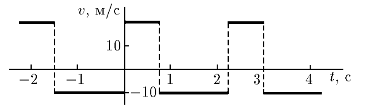

###  Statement 

$1.1.13.$ From the graph of the dependence of the coordinate on time, graph the dependence of the velocity on time. 

### Solution
1
  Two different velocities 

In this periodic motion, two velocity regimes can be distinguished: when the velocity is positive and when it is negative. 

Based on the speed definition, the speed in each mode will be $20 \, \text{m/s}$ and $10 \, \text{m/s}$, respectively: 

  The velocity graph you're looking for 

#### Answer

[See image](‘#sol’)
