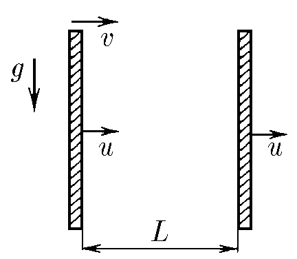
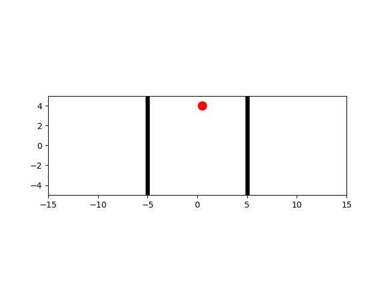

###  Statement 

$1.4.12.$ A body flies horizontally at speed $v$ into the space between two vertical walls that move at speed $u$. Determine the speed of the body after the $n$-th impact on the front wall. Distance between walls $L$. The blows are absolutely elastic. 
f

### Solution

  

Let's consider how the velocity $v_x$ changes along the horizontal axis $Ox$

When the body flies to the right wall, $v_x = v$. Then, after an elastic collision, the velocity changes to $v_x = v - 2u$. For more details on why this happens, see [1.4.9](../1.4.9).

Similarly, after hitting the left wall, $v_x$ will be equal to 

$$v_x = (v - 2u) + 2u = v$$

Thus, always after hitting the right wall, the speed of $v_x$ will be equal to $v - 2u$

$$v_x = v - 2u$$

And the time between $n$ and $n-1$ hits

$$ t_n - t_{n-1} = \frac{L}{v - 2u} + \frac{L}{v} $$ 

$$ t_n - t_{n-1} = L \frac{2(v-u)}{v(v-2u)} $$ 

Since there are no collisions in the vertical plane, the velocity $v_y$ depends on the time $t$ as

$$v_y = gt$$

And in the general case:

$$v_y = g(2n-1)(t_n - t_{n-1})$$

$$ \fbox{$v_y = (2n − 1)g L \frac{2(v-u)}{v(v-2u)}$} $$ 

#### Answer

The projection of the velocity on the horizontal direction $v_x = v −2u$; the projection of the velocity on the vertical direction $$v_y = (2n − 1)g L \frac{2(v-u)}{v(v-2u)}$$ 
