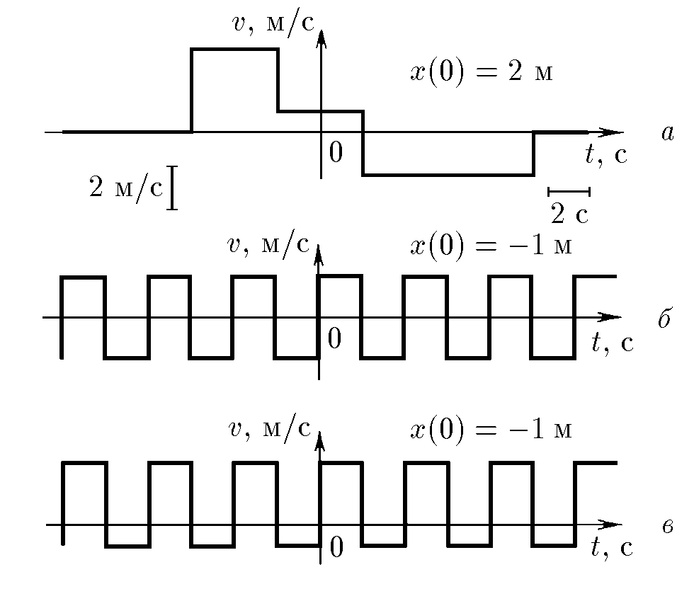
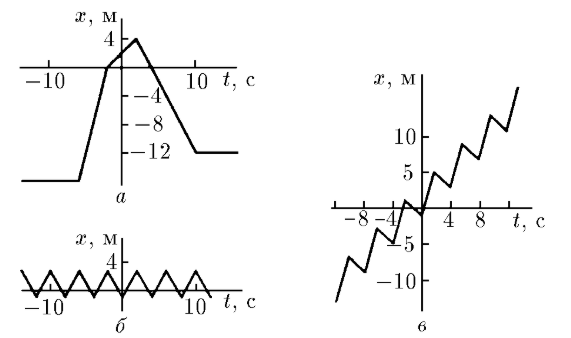
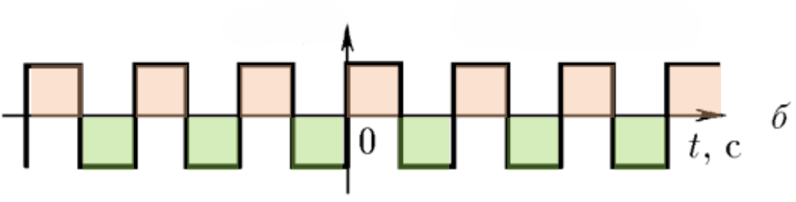
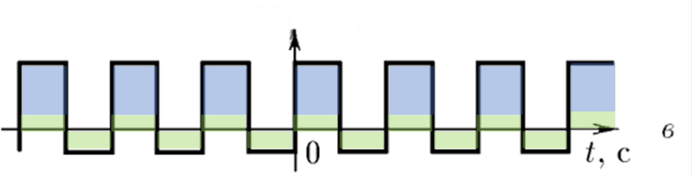

###  Условие: 

$1.1.15.$ По графикам зависимости скорости от времени постройте графики зависимости координаты от времени. Найдите в случаях $б$ и $в$ среднюю скорость за большое время. 

###  Решение: 

  Графики зависимости координаты от времени 

Учитывая физический смысл площади под графиком скорости от времени, получаем графики зависимости координаты от времени. 

  График б) зависимости скорости от времени 

В случае б), за равные промежутки времени, тело проходит вперед и назад одинаковое расстояние. Следовательно, за большое время, перемещение будет близким к нулю, а средняя скорость нулевая. 

$v_{ср} = 0 \; м/с$ 

  
  График в) зависимости скорости от времени 

В случае в) за равные промежутки времени, тело уже проходит не равные расстояния. За каждые 4 секунды, смещается в положительном направлении на 4 метра. 

Получаем: 

$v_{ср} = 1 \; м/с$ 

####  Ответ: См. рис.; б) $v_{ср} = 0$, в) $v_{ср} = 1 \, м/с$ 

  

