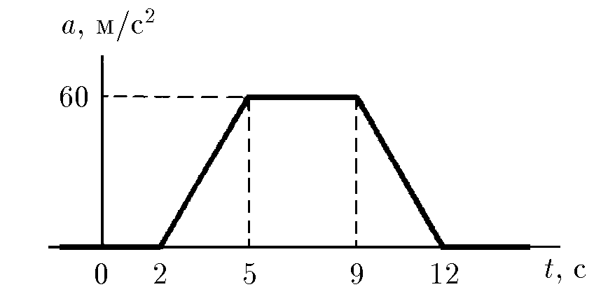
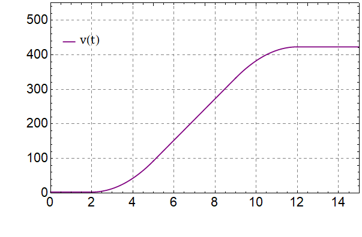

###  Условие: 

$1.2.14.$ По графику зависимости ускорения от времени установите скорость в моменты времени $4$ и $15\; с$, если в момент времени $1\; с$ скорость равна $3$ м/с. 

###  Решение: 

Ускорение зависит от времени, как: 

$\left\\{\begin{matrix} a(t) = 0\;м/с^2,\; 0\;c \leq t \leq 2\;c\\\ a(t) = 20t,\; 2\;c \leq t \leq 5\;c\\\ a(t) = 60\;м/с^2,\; 5\;c \leq t \leq 9\;c\\\ a(t) = 60-20(t-9),\; 9\;c \leq t \leq 12\;c\\\ a(t) = 0, t> 12\;c \end{matrix}\right.$ 

Учитывая, что площадь под графиком зависимости ускорения от времени, есть скорость от времени. Тогда скорость зависит от времени, как: 

$\left\\{\begin{matrix} v(t) = 3\;м/с,\; 0\;c \leq t \leq 2\;c\\\ v(t) = 3+20t^2/2,\; 2\;c \leq t \leq 5\;c\\\ v(t) = 93+60(t-5),\; 5\;c \leq t \leq 9\;c\\\ v(t) = 333 - 20 (t - 9)^2/2 + 60 (t - 9),\; 9\;c \leq t \leq 12\;c\\\ v(t) = 423\;м/с, t> 12\;c \end{matrix}\right.$ 

График данной зависимости представлен ниже: 

  Зависимость скорости от времени 

Отсюда следует, что при $4$ и $15\;с$ скорость составляет $43$ и $423\;м/с$, соответственно. 

####  Ответ: $v_1=43\;м/с; \;v_2=423\;м/с.$ 

  

