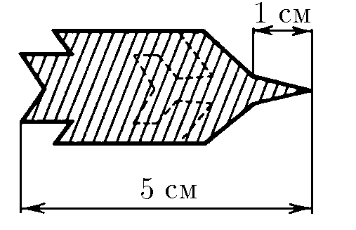
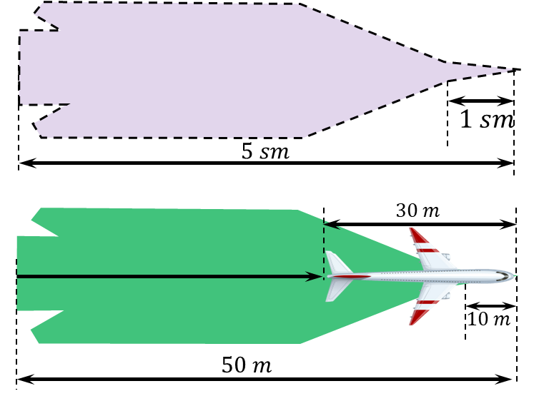

###  Statement

$1.1.1.$ Figure$^{*)}$ shows a "blurred photograph" of a jet airplane in flight. The length of the airplane is $30 \text{ m}$, the length of its nose is $10 \text{ m}$. Determine from this "photograph" the speed of the airplane. The shutter exposure time is $0.1 \text{ s}$. The shape of the airplane is shown in the figure with a dashed line.

#### Solution

To find the velocity of the airplane it is necessary to determine the vector of its displacement for the time $T$, during which the shutter of the camera is open. Let us select the initial point $1$ in the photograph and determine the distance it will move during the time $T$. The length of the airplane must be subtracted from the total length of the photograph. Taking into account the scale, the modulus of displacement will be

$$
l=50-30 = 20 \text{ m}
$$

For the $0.1 \text{ s}$ aiplane covered a distance of $20\text{ m}$, which corresponds to velocity of

$$
\boxed{v = \frac{l}{T} = 200\text{ m/s}}
$$

#### O'zbekcha

$1.1.1.$ Rasmda*) uchayotgan reaktiv samolyotning
harakatdan ”siljigan” rasmi keltirilgan. Samolyot uzunligi $30 \text{ m}$
 burun qismining uzunligi $10 \text{ m}$. Mazkur ”siljigan” rasmga
ko’ra samolyot tezligini aniqlang ($m/s$). Rasmga olishda fotoapparat ekspozitsiya vaqti $0.1 \text{ s}$. Samolyot shakli rasmda
shtrixlab ko’rsatilgan

#### Yechim

Samolyotning tezligini aniqlash uchun kamera yopqichi ochiq bo‘lgan $T$ vaqt davomida uning siljish vektorini aniqlash zarur. Fotosuratda boshlang‘ich $1$ - nuqtani tanlaymiz va ushbu nuqta $T$ vaqt ichida qancha masofaga siljishini aniqlaymiz. Fotosuratdagi umumiy uzunlikdan samolyotning uzunligini ayirish kerak. Masshtabni hisobga olgan holda, siljishning moduli quyidagicha bo‘ladi:

$$
l=50-30 = 20 \text{ m}
$$

$0.1 \text{ s}$ davomida samolyot $20\text{ m}$ masofani o'tadi, bu orqali tezlikni topsak:

$$
\boxed{v = \frac{l}{T} = 200\text{ m/s}}
$$

