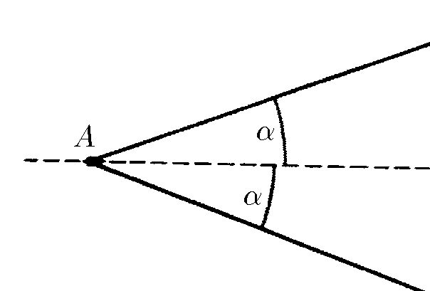
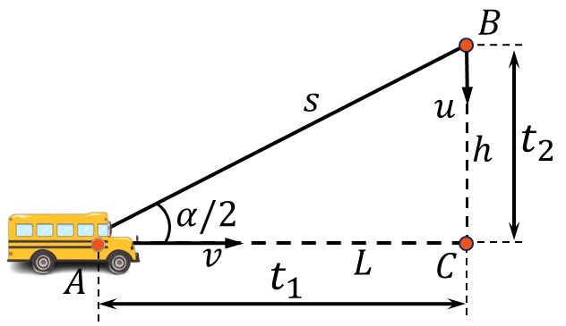
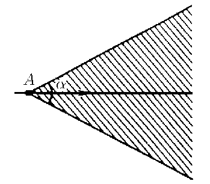

###  Statement 

$1.1.10^*.$ A bus is driving along a straight highway at constant speed $v$. You have noticed the bus when it was at some point $A$. From what area near the highway can you catch up with this bus if your running speed is $u < v$? Draw this area for $u = v/2$.  

### Solution

1\. Let the bus is at point $A$, and the catching up person starts from point $B$ and runs perpendicular to the roadway $AC$. Let us introduce the notations: $AC = L, BC = h, AB = s.$ 

2\. From right-angled triangle $ABC$ we have 

$$L = s \cdot \cos\frac{\alpha}{2};\quad h = s \cdot\sin\frac{\alpha}{2}$$ 

3\. Travel time of bus $t_1$ and passenger $t_2$ before meeting at point $C$ 

$${t}_{1}=\frac{{L}}{{v}}=\frac{{s}\cos(\alpha /2)}{{v}};\quad{t}_{2}=\frac{{h}}{{u}}=\frac{{s}\sin(\alpha /2)}{{u}}$$ 

where from 

$$\fbox{$\alpha = 2 \cdot \arcsin \frac{u}{v}$}$$ 

#### Answer

From the region bounded by the angle $\alpha = 2 \arcsin (u/v)$ with vertex at the point $A$, bisected by the motorway 
