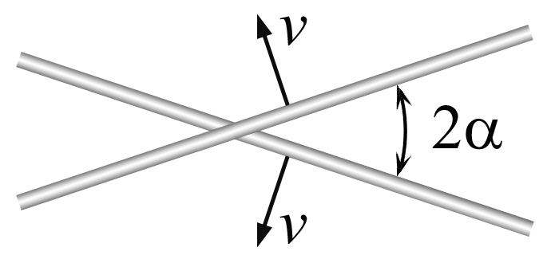
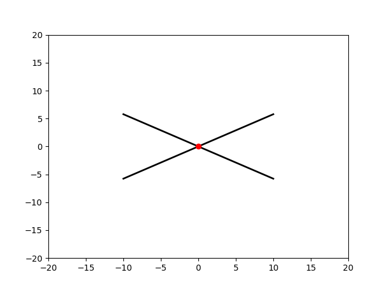

###  Statement

$1.1.12^*.$ Two rods intersect at an angle $2 \alpha$ and move with equal velocities $v$ perpendicular to themselves. What is the velocity of the intersection point of the rods?

### Solution

As shown in the animation, the intersection point will remain on the bisection of the angle $2\alpha$ between them as they move

Consider the change of the intersection point on the horizontal axis during the time interval $dt$

From the geometry of a right triangle, the horizontal coordinate (aka hypotenuse) has changed to $dx = v dt / \sin\alpha$

From where the speed:

$$
\fbox{$u = \frac{dx}{dt} = \frac{v}{\sin\alpha}$}
$$

#### Answer

$$
u = v/ \sin\alpha
$$