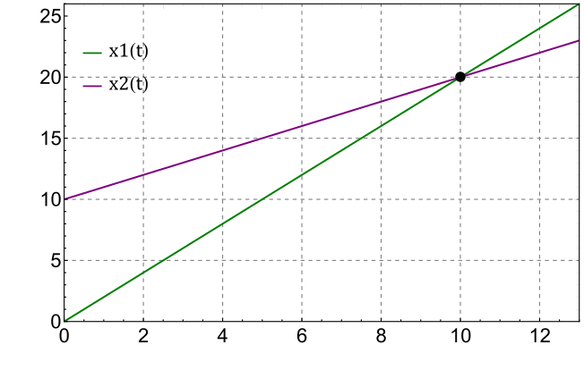

###  Statement

$1.1.14.$ Using coordinate-time graphs, find the point in time and place of collision of particles moving along one straight line. The speed of the first particle is $v$, the speed of the second particle is $v/2$. The first particle at time $t = 0$ had coordinate $x = 0$, the second particle at time $t_1$ had coordinate $x = a$.

### Solution

The law of motion of the first particle:

$$
x_1(t) = vt \tag{1}
$$

The law of motion of the second particle:

$$
x_2(t) = \frac{v}{2}(t-t_1) + a
$$

Crossing condition at the moment of time $t_2$:

$$
x_1(t_2)=x_2(t_2) \Leftrightarrow vt_2 = \frac{v}{2}(t_2-t_1) + a
$$

From where

$$
t_2 = \frac{2a}{v} - t_1 \tag{2}
$$

Substituting $(2)$ into $(1)$:

$$
{x}' = 2a - vt_1
$$

#### Answer

The ordinate and abscissa of the point of intersection of the graphs $x_{1} = vt$ and $x_{2} = a + v(t - t_{1})/2$ give the time and coordinate of the point of impact of the particles:

$$
t_2 = (2a - vt_{1})/v, \quad {x}' = 2a - vt_{1}
$$