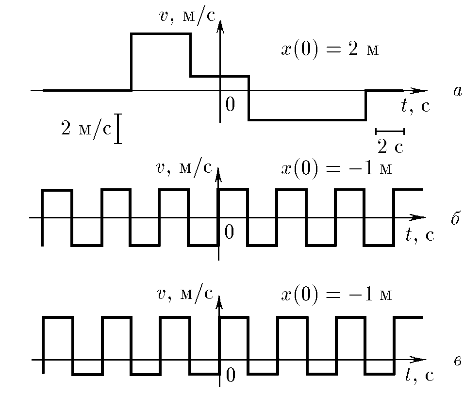
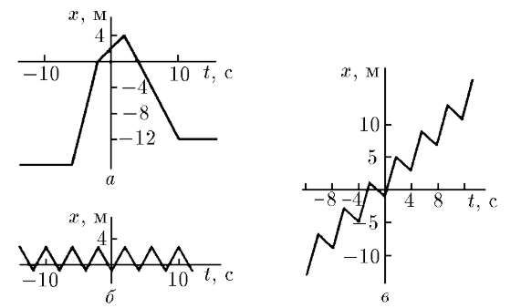
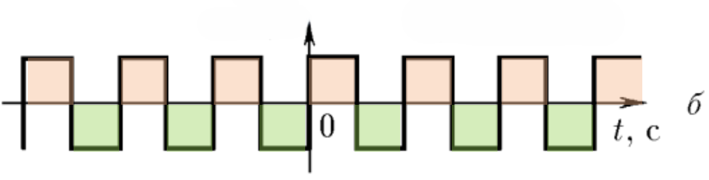
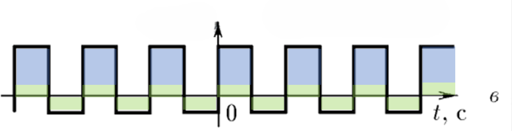

###  Statement 

$1.1.15.$ Using the velocity-time graphs, plot the coordinate-time graphs. In cases $b$ and $c$ find the average velocity over a large time. 

### Solution

  

Taking into account the physical meaning of the area under the graph of velocity versus time, we obtain the graphs of the dependence of the coordinate on time. 

In case $b$), in equal time intervals, the body travels forward and backward the same distance. Consequently, for a large time, the displacement will be close to zero and the average velocity will be zero. 

$$v_{av} = 0 \text{ m/s}$$

In case $c$) for equal time intervals, the body is no longer travelling equal distances. For every 4 seconds, it moves in the positive direction by 4 meters. 

Here we go: 

$$v_{av} = 1 \text{ m/s}$$

#### Answer

a) See figure; 
b) $v_{av} = 0$, 
c) $v_{av} = 1 \text{ m/s}$ 