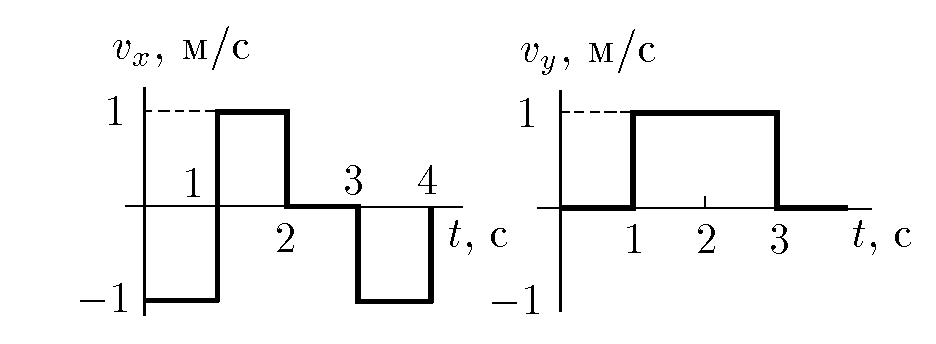
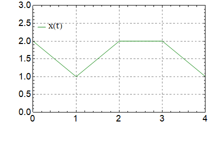
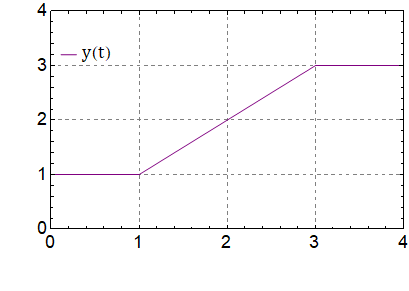
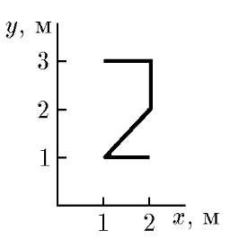

###  Statement 

$1.1.16.$ A particle moves in one plane. From the graphs of the time dependence of the velocity projections $v_x$ and $v_y$ plot the trajectory of the particle if $x_{(0)} = 2$ m, $y_{(0)} = 1$ m. 

### Solution

Taking into account the physical meaning of the area under the graph of velocity versus time, we obtain the graphs of the dependence of coordinate versus time. 

  Graph of dependence $x(t)$    Graph of dependence $y(t)$ 

Overlaying the graph of the dependence of $x(t)$ and $y(t)$ on each other at the corresponding time intervals, we obtain: 

  Trajectory of movement 

#### Answer

See figure. 
