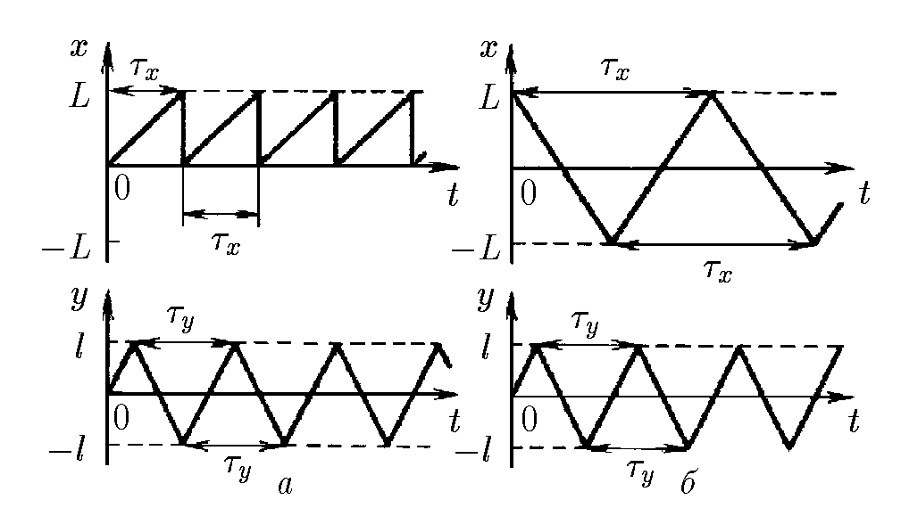
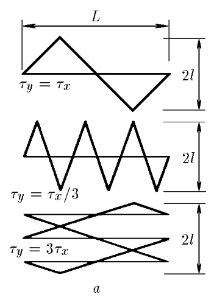
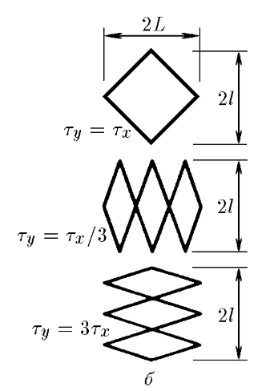

###  Statement

$1.1.17.$ The motion of the beam on the oscilloscope screen is described by plots of $x$ and $y$ coordinates versus time. What picture will appear on the screen when $\tau_y = \tau_x$, $\tau_x/3$, $3 \tau_x$? Consider the two cases (see figure 1.1.17). In case a, the horizontal lines are almost invisible on the screen. Why? At what ratio of $\tau_x$ and $\tau_y$ in case b is the trajectory of the beam on the screen closed?

### Solution

a) The return of the beam along the coordinate $x$ takes very little time, respectively, few electrons fall per unit length of the luminescent surface of the screen.

b) when $\tau_y/\tau_x = m/n$, where $m$ and $n$ are any integers.

#### Answer

See Fig.