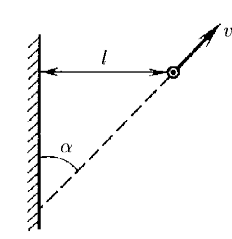
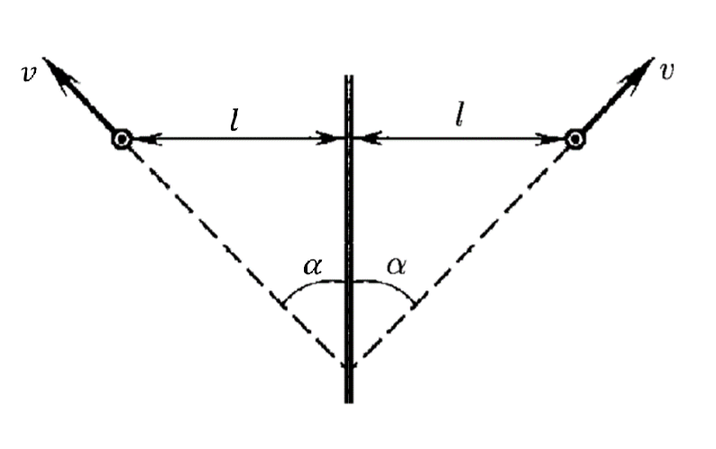
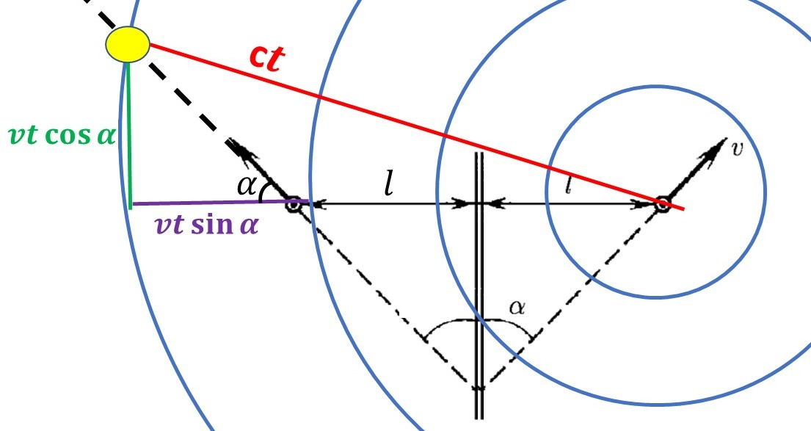

###  Statement

$1.1.18^*.$ The car moves with speed $v$ away from a long wall, moving at an angle $\alpha$ to it. At the moment when the distance to the wall equals $l$, the driver gives a short beep. How far will the car travel before the chauffeur hears the echo? The speed of sound in the air is $c$.

### Solution

Since the sound signal from the car is immediately reflected from the wall, it is possible to mirror the signal from the car, as ‘if’ the sound signal catches up with the imaginary image of a moving car

Further, we take the fact that in time $t$, the sound travels distance $ct$ and the car distance $vt$ along the line of its motion:

Let us write the Pythagorean Theorem for the resulting right triangle:

$$
(vt\cos\alpha )^2+(vt\,\sin\alpha + 2l)^2 = c^2t^2
$$

Rewrite the quadratic equation as:

$$
(v^2-c^2)t^2 + 4lvt\sin\alpha + 4l^2= 0
$$

We get a positive root:

$$
t=2l\frac{v\;\sin\alpha +\sqrt{c^2-v^2\;\cos^2 \alpha}}{c^2-v^2}
$$

Since the distance travelled by the car until the driver hears the sound is $x=vt$, the distance is found as:

$$
\fbox{$t=2l\frac{v\;\sin\alpha +\sqrt{c^2-v^2\;\cos^2 \alpha}}{c^2-v^2}$}
$$

#### Answer

$$
x=2l\frac{v\;\sin\alpha +\sqrt{c^2-v^2\;\cos^2 \alpha}}{c^2-v^2}
$$