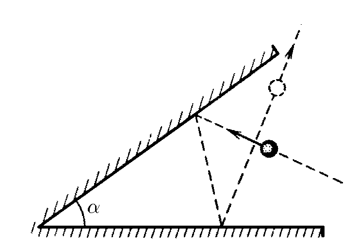
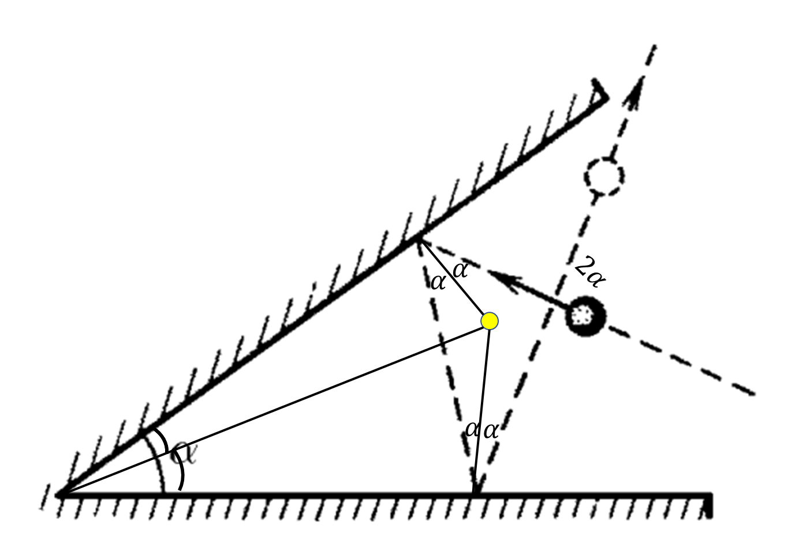

###  Statement 

$1.1.19.$ By what angle will the direction of velocity of the ball change after two elastic impacts on the walls, the angle between which is equal to $\alpha$? How will the ball fly if the angle $\alpha = \pi /2$? The motion occurs in a plane perpendicular to the walls. In an elastic collision with a smooth stationary wall, the angle of incidence of the ball is equal to the angle of reflection. 

### Solution

When falling elastically on a horizontal plane, the angle of incidence is equal to the angle of reflection. 

Thus, the direction of velocity of the ball after two elastic impacts will change by the angle $\beta = 2\alpha$ 

When $\alpha =\pi /2$, $\beta = \pi$, i.e., the ball will fly in the opposite direction.. 

#### Answer

$\beta = 2\alpha$. In the direction opposite to the initial 
