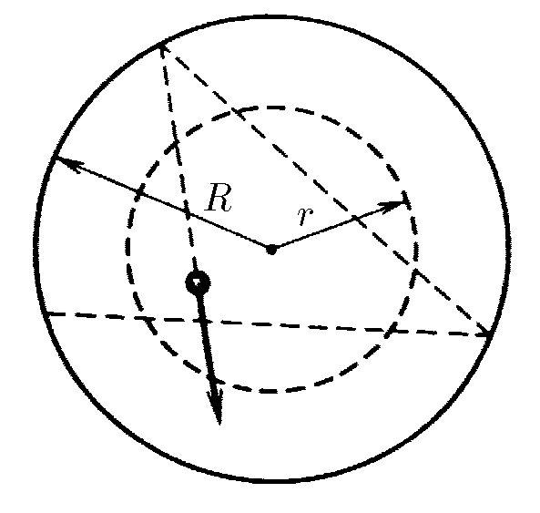

###  Statement 

$1.1.22.$ Inside a fixed smooth-walled cylinder of radius $R$ a small ball is flying, elastically reflecting from the walls so that the minimal distance from it to the cylinder axis is $h$. What fraction of time is the distance from the cylinder axis less than $r$ but greater than $h$? 

### Solution

  

Let's consider the motion of the ball described in the problem condition 

Since the impact velocity does not change between impacts, and impacts are absolutely elastic, we can consider the velocity unchanged. Consequently, for equal time intervals the body passes equal distances. 

Then the required ratio $\frac{\Delta t}{t}$ is found as the ratio $\frac{BC}{AD}$ 

$$\frac{\Delta t}{t} = \frac{BC}{AD}$$ 

By Pythagoras' theorem: 

$$BC = 2 \sqrt{r^2-h^2}$$ 

$$AD = 2 \sqrt{R^2-h^2}$$ 

From where 

$$\frac{BC}{AD} = \frac{\sqrt{r^2-h^2}}{\sqrt{R^2-h^2}}$$ 

This expression can be rewritten as

$$\frac{\Delta t}{t} = \frac{\sqrt{r^2-h^2}}{\sqrt{R^2-h^2}}$$ 

#### Answer

$$\Delta t/t=\sqrt{(r^2-h^2)/(R^2-h^2)}$$ 
