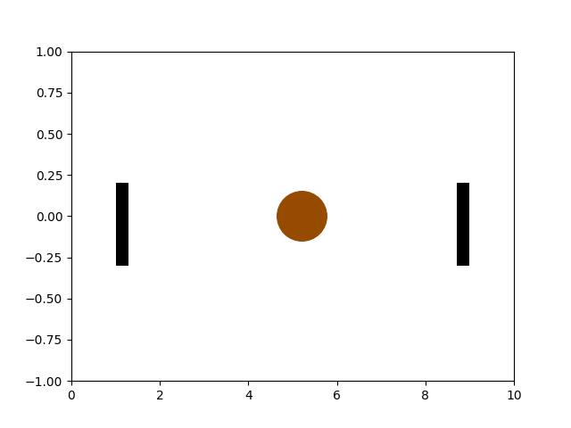

###  Statement 

$1.1.23^*.$ The shooter tries to hit a disk of radius $R$, which moves from one wall to another at constant modulo velocity so fast that it cannot be tracked. Draw a graph of the probability of hitting the disk as a function of the distance between the aiming point and the left wall. 

The shots are fired at height $R$ from the floor perpendicular to the direction of motion of the disc. At what point is the least and most probable shot? What is their value? Consider the cases $L > 4R$, $4R > L > 2R$, where $L$ is the distance between the walls. 

### Solution

When the target is moving, a bystander is less likely to see the target from the edge, as it stays there for a shorter period of time. 

Thus, the maximum probability will be observed on the interval: 

$$\left\\{\begin{matrix} 0 \leq x < 2R\\\ L-2R < x \leq L \end{matrix}\right.$$ 

Since the velocity of the target is constant, and finding the target in the range $2R \leq x \leq L-2R$ is equally likely, the probability of finding it in this range is equal to the ratio of the diameter to the length of this range: $\frac{2R}{L-2R}$. 

Graphs corresponding to these modes: 

#### Answer

See Fig. Zero at the walls. The largest at any place at a distance from the walls, greater than $2R$, and equal to $2R/(L-2R)$ at $L > 4R$; at any place at a distance from the walls greater than $L - 2R$, and equal to one at $4R > L > 2R$. 
