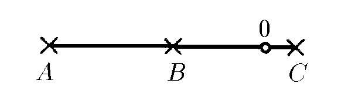

###  Statement

$1.1.5^*.$ Three microphones located on the same straight line at points $A$, $B$, $C$ recorded successively at the moments $t_A > t_B > t_C$ the sound of an explosion that occurred at point $O$, which lies on the segment $AC$. Find the length of the segment $AO$ if $AB = BC = L$. At what point in time did the explosion occur?

### Solution

Let the explosion occurred at time $t_0$, then the time of signal registration at point $A$ is equal to:

$$
t_A = t_0 + \frac{L + x}{c}, \tag{1}
$$

where $x = BO$. Similar to point $B$

$$
t_B = t_0 + \frac{x}{c}, \tag{2}
$$

For point $C$

$$
t_C = t_0 + \frac{L - x}{c}, \tag{3}
$$

Let's subtract the second equation from the first equation:

$$
t_A – t_B = \frac{L}{c}. \tag{4}
$$

And from the first equation we subtract the third equation

$$
t_A – t_C = \frac{2x}{c}. \tag{5}
$$

From equation $(4)$ let's express

$$
c = \frac{L}{t_A – t_B},
$$

and from $(5)$

$$
x = \frac{t_A – t_C}{2} \cdot c.
$$

Then the required distance:

$$
AO = L + x = L + \frac{t_A – t_C}{2}\frac{L}{t_A – t_B}
$$

After the transformation

$$
AO = \frac{3t_A – 2t_B – t_C}{2(t_A – t_B)} \cdot L. \tag{6}
$$

To determine the moment of time at which the explosion occurred, we substitute in the expression

$$
t_A = t_0 + \frac{L + x}{c}, \; c = \frac{L}{t_A – t_B}
$$

$$
\frac{t_A – t_C}{2} = \frac{x}{c}
$$

after transformations

$$
t_0 = t_B - \frac{1}{2} \cdot (t_A – t_C)
$$

#### Answer

$$
AO = \frac{3t_A – 2t_B – t_C}{2(t_A – t_B)} \cdot L, \; t_0 = t_B - \frac{1}{2} \cdot (t_A – t_C)
$$