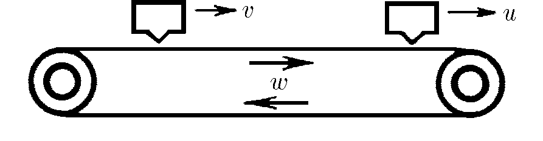

###  Statement 

$1.1.8.$ The conveyor belt has speed $w$. Above the belt moves a machine, throwing $\nu$ balls per unit time. The balls stick to the belt. A ball counter with a photocell counts only the balls that have passed directly under it. How many balls will the counter count in a unit of time if the speed of the machine is $v < w$, the speed of the counter is $u < w$?  

### Solution

1\. If the automaton and the counter are at rest, T.e. $v=u=0$, then the counter will register $N_0$, balls during the time $\Delta t$. 

$$N_0 = \nu\Delta t$$ 

2\. If the automaton is at rest ($v = 0$) and the counter is moving with speed $u$, the number of registered particles is 

$$N_1 = \nu\frac{w-u}{w+v} \Delta t$$ 

3\. When the automaton and the counter move, the number of particles during the time $\Delta t$ is defined as 

$$N_2 = \nu\frac{w-u}{w-v} \Delta t$$ 

per unit of time 

$$n = \nu\frac{w-u}{w-v}$$ 

#### Answer

$${ν}' = ν\frac{w − u}{w − v}$$ 
