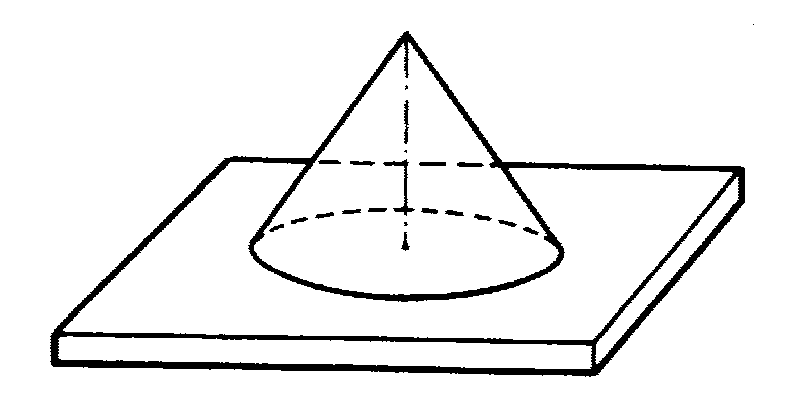
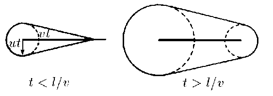

###  Statement 

$1.1.9.$ a. A rod of length $l$ is made of explosive material. The detonation velocity (the rate of involvement in the explosion of new parts of the explosive) is equal to $v$, and the rate of spreading of the products of the explosion is $u < v$. How does the region occupied by the products of the explosion change with time if the rod is detonated at one end? Make a drawing. 

b. From the same explosive material it is necessary to make such a thin-walled conical shell so that when detonating it from the top, the products of the explosion simultaneously hit the rod on the axis of the cone. What angle between the axis of the cone and the generatrix should be chosen?  

### Solution

1\. The configuration of the region occupied by the products of the explosion until the moment of complete oxidation of the rod, at $\tau < L/v$ will have the form of a cone of height $h = vt$, the base of which is a hemisphere of radius $R = u \cdot t$. 

2\. After the rod oxidation is over, i.e. for time $\tau\geq L/v$, the product region will be bounded by two hemispheres with radii 

$$R=ut;\quad r=u\left(t-\frac{L}{v}\right)$$ 

      <figure>
        
        <figcaption> Figure to part b) </figcaption>
      </figure>
      

1\. If the length of the cone's trunk is $L$, then its height $h$ is determined by Eq. 

$$h = L \cdot \cos\alpha$$ 

from where 

$$L = \frac{h}{\cos\alpha}$$ 

2\. According to the problem condition $t_1=t_2$, i.e. 

$${t_{1}=\frac{h}{u}=\frac{L\cos\alpha}{u};\quad t_{2}=\frac{L}{v},}$$ 

from where 

$$\frac{{L}}{{v}}=\frac{{L}\cos\alpha}{{u}}\quad\Rightarrow\quad\fbox{$\cos\alpha =\frac{{u}}{{v}}$}\quad$$ 

#### Answer

$a$. At $t < l/v$, the boundary of the region is a cone with the apex located at a distance $vt$ from the end of the rod, passing into a sphere of radius $ut$ touching it. At $t > l/v$, the spheres are spheres with centres at the ends of the rod and radii $ut$ and $u(t - l/v)$ with a conical surface tangent to them. tangent to them. $\\\ b^{∗}. \; \cos\alpha = u/v$ 
