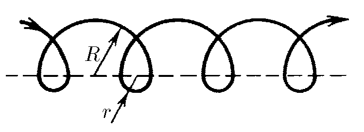

###  Statement

$1.2.1.$ The figure shows the trajectory of an electron that drifts along an interface plane of regions with different magnetic fields. Its trajectory consists of alternating semicircles of radius $R$ and $r$. The velocity of the electron is constant modulo and equals $v$. Find the average velocity of the electron over a long period of time.

### Solution

Consider the motion of an electron from point $ A $ to point $ B $. At these points the electron is in equal “phase”. The subsequent motion of the electron will be repeated.

Movement of an electron along the interface

$$
S = N \cdot (2R - 2r)
$$

The time taken is equal to the sum of

$$
t = N \cdot \left( \frac{\pi R}{v} + \frac{\pi r}{v} \right) = N \cdot \frac{\pi}{v} \cdot (R + r)
$$

Average velocity of an electron over a large time interval

$$
v_\text{av} = \frac{S}{t} = \frac{N \cdot 2(R - r)}{N \cdot \frac{\pi}{v}(R + r)}
$$

after conversion

$$
\fbox{$v_\text{av} = \frac{2}{\pi} \cdot v \cdot \frac{R - r}{R + r}$}
$$

#### Answer

$ v_{\text{av}} = \frac{2}{\pi} v \frac{R - r}{R + r} $, directed along the interface