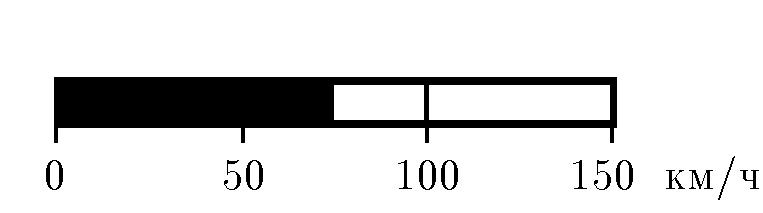

###  Statement 

$1.2.19.$ The speedometer scale is $15$ cm long and measures the vehicle speed from zero to $150$ $\frac{km}{h}$. Find the speed of the speedometer indicator if the car is moving at an acceleration of $2$ $\frac{m}{s^2}$. 

### Solution

Equation for equal accelerated motion $$150 \text{ km/h}=0 \text{ km/h}+at_n$$ Acceleration time from zero to full speed $$t_n=20.83 \text{ s}$$ During this time, the speedometer arrow will travel the distance $$15 \text{ sm}=ut_n$$ making the speed equal to $$u=0.72 \text{ sm/s}$$ 

#### Answer

$$v = 0.72 \text{ sm/s}$$ 
