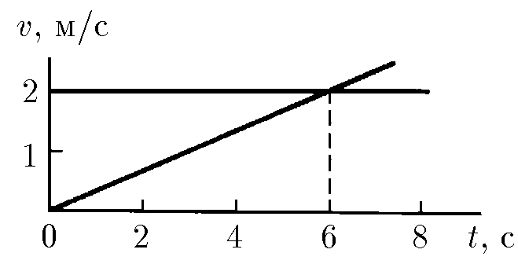

###  Statement 

$1.2.2.$ Two particles at time $t = 0$ have left the same point. Using the velocity-time graphs, determine the coordinates and time of the new meeting of the particles. 

### Solution

  Coordinates of points and their intersection 

1\. Equations of motion of particles. 

$$ {x_{1}(t) = v_{1}t, \quad x_{2}(t) = \frac{at^2}{2}} $$ 

2\. The velocity of the first particle and acceleration of the second particle are determined by the given dependence $v = f(t)$: 

$$ {v_{1} = 2\; \frac{m}{s}}, \quad a \equiv 0.33\; \frac{m}{s^{2}}. $$ 

3\. Particle encounter condition: 

$$ x_{1}(t_{z}) = x_{2}(t_{z}). \quad t_{z} = \frac{2v_{z}}{a} = 12\; c, \quad x_{z} = 24\; m. $$ 

#### Answer

From the region bounded by the angle $\alpha = 2 \, \arcsin \frac{u}{v}$ with vertex at the point $A$, bisected by a freeway. 
