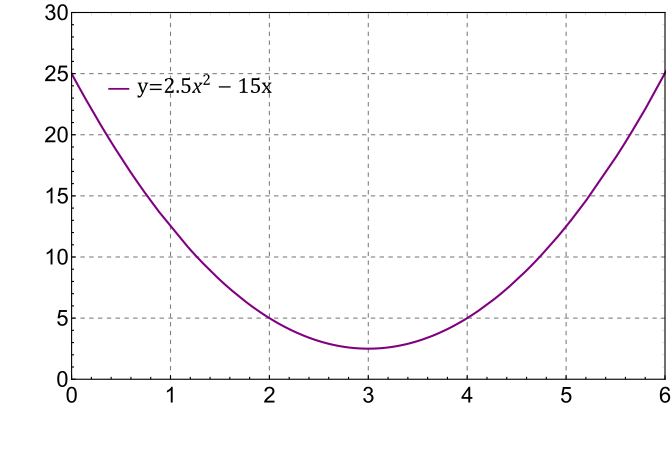

###  Statement 

$1.2.4.$ Draw a graph of coordinate versus time for a rectilinear motion that satisfies two conditions simultaneously: a. the average speed in the time interval from $2$ to $6\text{ s}$ is $5\text{ m/s}$; 
b. the maximum speed in the same interval is $15\text{ m/s}$. 

### Solution

It is necessary to choose such a dependence so that the derivative of the coordinate in time, aka velocity, obeys the conditions of the problem. 

An example of such a function is shown at the bottom: 

The derivative of $x(t) = 2.5t^2-15t$ is equal to 

$$v(t) = 5t-15$$

What satisfies the conditions of the problem. 

#### Answer

Any graph with a coordinate change of $20\text{ m}$ in the specified time and with the greatest “slope” of the tangent $15\text{ m/s}$