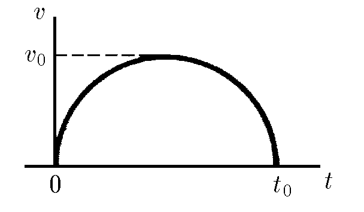

###  Statement

$1.2.6.$ The graph of the velocity of the body versus time looks like a semicircle. Maximum velocity of the body $v_0$, time of motion $t_0$. Determine the distance traveled by the body.

### Solution

The traveled path can be found as the area under the graph $v(t)$. If the area of the semicircle $S=\pi r^2/2$, then the required path:

$$
x = \frac{\pi v_0t_0}{4}
$$

#### Answer

$$
x = (\pi /4)v_0t_0
$$