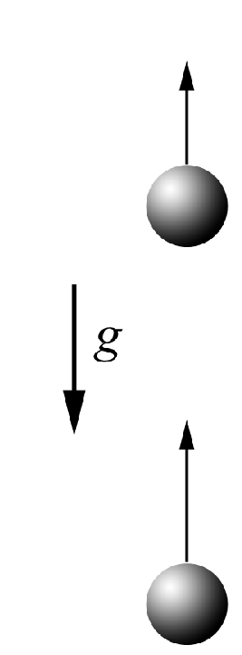

###  Statement

$1.3.1.$ Two balls with velocity $v$ are thrown vertically upwards from the same point with time interval $\Delta t$. How long after the second ball leaves, will they collide?

### Solution

 

The velocity of the first ball after an interval of time $\Delta t$:

$$
v_0 = v - g \Delta t
$$

The relative velocity of the 1st and 2nd balls will remain constant and equal:

$$
v_\text{average} = g \Delta t
$$

Meanwhile, during the time $\Delta t$, the 1st ball has risen to a height of

$$
L = v_0 \Delta t - \frac{g \Delta t^2}{2}
$$

The time in which they will collide will find how:

$$
t = \frac{L}{v_\text{average}}
$$

$$
\fbox{$t = \frac{v}{g} - \frac{\Delta t}{2}$}
$$

#### Answer

$$
t = v/g − \Delta t/2
$$