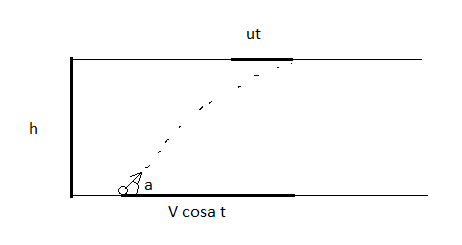

###  Statement 

$1.3.10.$ The duck was flying in a horizontal straight line with a constant speed $u$. An inexperienced "hunter" threw a stone at it, and the throw was made without pre-emption, i.e. at the time of the throw, the speed of the stone $v$ was directed just at the duck at an angle $\alpha$ to the horizon. At what height did the duck fly, if the rock still hit it? 

### Solution

Let's consider this equation of motion: $$ y = h = \nu\sin\alpha - \frac{gt^{2}}{2} $$ It is known that: $$ \left\\{\begin{matrix} S_{yt}=ut \\\ S_{o}=\nu t \cos\alpha \end{matrix}\right. $$ For angle $\alpha$: $$ \tan\alpha = \frac{h}{S_{o} - S_{yt}} = \frac{h}{t(\nu\cos\alpha - u)} $$ We substitute the value of the angle $\alpha$ into the equation for the height: $$ h = t (\nu\cos\alpha - u) \tan\alpha = \nu t \sin\alpha - \frac{gt^{2}}{2} $$ From this equation we can express time $t$: $$ t = \frac{2u \tan\alpha}{g} $$ We substitute the time value $t$ back into the equation for height: $$ \fbox{$h = \frac{2u \tan^{2} \alpha}{g} (\nu\cos\alpha - u)$} $$ 

#### Answer

$$h=\frac{2utg^{2}\alpha}{g}(\nu\cos\alpha -u)$$ 
