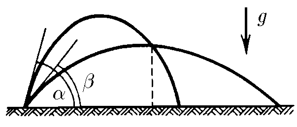

###  Statement 

$1.3.11.$ From the opening of the hose covered with a finger, two jets are shot at an angle $\alpha$ and $\beta$ to the horizon with the same initial velocity $v$. At what horizontal distance from the hole will the jets intersect? 

### Solution

$$ vt_{1} \cdot \cos\alpha = vt_{2} \cdot \cos\beta$$ $$ vt_{1}\cdot \sin\alpha - \frac{gt_{1}^{2}}{2}=vt_{2}\cdot \sin\beta -\frac{gt_{2}^{2}}{2} $$ 

From the first equation,

$$ t_{1}=t_{2} \cdot \frac{\cos\beta}{\cos\alpha} $$ 

We substitute $t_{1}$ into the second equation and express $t_{2}$. Trigonometric formulas 63 will come in handy. The $t_{2}$ we have already obtained is enough to insert into $x=vt_{2}\cos\beta$, where $x$ is the desired distance.

Using trigonometric formulas:

$$ t_{2}= \frac{2\nu^{2}}{g(\tan\beta +\tan\alpha )\cos\beta} $$ $$ \fbox{$x = \frac{2\nu^{2}}{g(\tan\beta +\tan\alpha )}$} $$ 

#### Answer

$$x = \frac{2\nu^{2}}{g(\tan\beta +\tan\alpha )}$$ 
