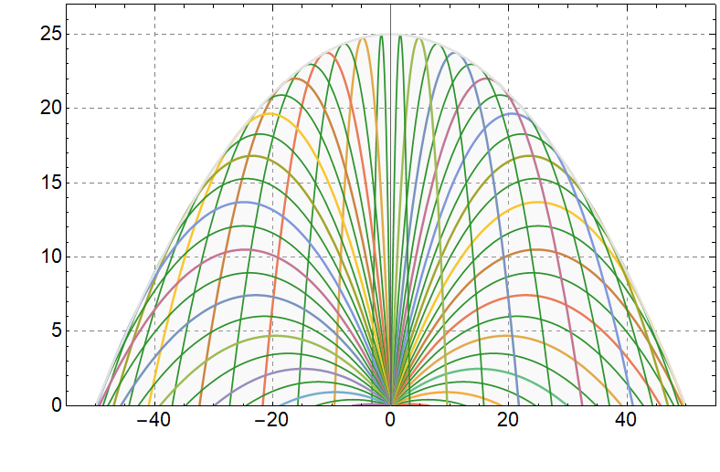

###  Statement

$1.3.13^*.$ From a hose lying on the ground, water shoots at an angle of $45^\circ$ to the horizon with an initial velocity of $10~\mathrm{\frac{m}{s}}$. The cross-sectional area of the hose opening is $5~\text{sm}^2$ . Determine the mass of the jet in the air.

### Solution

a) We will use the formula for the flight path obtained in [1.3.6](../1.3.6):

$$
y(x) = x \tan\varphi-\frac{gx^2}{2v^2\cos^2 \varphi}
$$

Let's use the hint,

$$
y(x) = x \tan\varphi-\frac{gx^2}{2v^2}(1+\tan^2 \varphi)\tag{1}
$$

Where do we express the angle $ \varphi$:

$$
\tan\varphi=\frac{v^2\pm\sqrt{v^4-2gv^2y-g^2x^2}}{gx}
$$

b) Let's depict a set of trajectories, changing the angle $\varphi$ from $-\frac{\pi}{2}$ to $\frac{\pi}{2}$:

Having analyzed the domain of definition of the function $(1)$, we emphasize that the expression under the root is not negative

$$
v^4-2gv^2y-g^2x^2 \geq 0
$$

$$
y \leq \frac{v^2}{2g}-\frac{gx^2}{2v^2}
$$

c) From $(1)$, we get:

$$
v_{x}v_{y}x-\frac{1}{2}gx^{2}=v_{x}^{2}y
$$

We will use the formula for horizontal and vertical coordinates obtained in [1.3.6](../1.3.6):

$$
y(t) = vt \cdot \sin{\varphi} - \frac{gt^2}{2}
$$

$$
x(t) = vt \cdot \cos{\varphi}
$$

Let $\xi =\cos{\varphi}$,

$$
v_y = v \xi
$$

$$
v_x = v \sqrt{1-\xi^2}
$$

Getting a function

$$
v(\xi )=\frac{\sqrt{g}x}{\sqrt{2 \xi\sqrt{1-\xi^{2}}x-\xi^{2}y}} \tag{2}
$$

The maximum of the radical value corresponds to the minimum of the function (2)

$$
\frac{\sqrt{x^{2}+y^{2}-y}}{2} \rightarrow \max
$$

Minimum of function $(2)$

$$
\fbox{$v^{2}=\frac{gx}{\sqrt{1+(\frac{y}{x})^{2}}-\frac{y}{x}}$}
$$

#### Answer

$$
\tan\varphi=\frac{v^2\pm\sqrt{v^4-2gv^2y-g^2x^2}}{gx}.
$$

$$
y=\frac{v^2}{2g}-\frac{gx^2}{2v^2}
$$

$$
v_{\text{min}}=\sqrt{g(y+\sqrt{x^2+y^2})}
$$