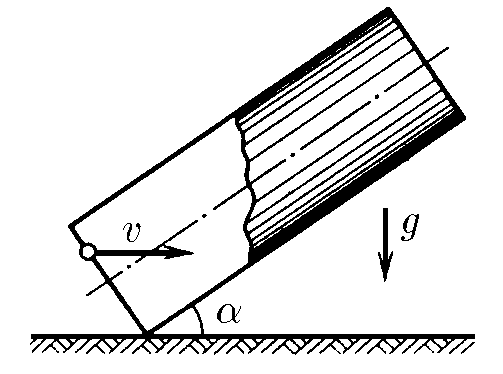

###  Statement

$1.3.16^*.$ A ball flies into a tube of length $l$, inclined at an angle $\alpha$ to the horizon, with a horizontal velocity $v$. Determine the time of the ball's stay in the pipe, if the ball hits its walls elastic.

### Solution

a) Find the condition under which there will be no collisions$(x=0)$

From the law of conservation of energy:

$$
\frac{mv_0^2}{2} = mgl \cdot \sin\alpha
$$

$$
v_{0}\leq\frac{\sqrt{2gl\sin\alpha}}{\cos\alpha}
$$

In this case, time will pass

$$
t = \frac{2v_0}{g} \text{ctg} \alpha
$$

b) Now let's look at those cases when touching occurs:

$$
v_{0}>\frac{\sqrt{2gl\sin\alpha}}{\cos\alpha}
$$

Path between two touches:

$$
L=v_{0}\cos\alpha t-\frac{g\sin\alpha t^{2}}{2}
$$

When we receive the required time, we choose the one that is smaller, because we need to find the time when it will come out

$$
t=\frac{v_{0}\cos\alpha -\sqrt{v_{0}^{2}\cos^{2}\alpha -2g\sin\alpha L}}{g\sin\alpha}
$$

#### Answer

$\begin{aligned}&t=\frac{2v}{g}\operatorname{ctg}\alpha\text{ with }v\cos\alpha <\sqrt{2gl\sin\alpha};\\\ &t=\frac vg\operatorname{ctg}\alpha\bigg(1-\sqrt{1-\frac{2gl\operatorname{tg}\alpha}{v^2\cos\alpha}}\bigg)\text{ with }v\cos\alpha >\sqrt{2gl\sin\alpha}.\end{aligned}$