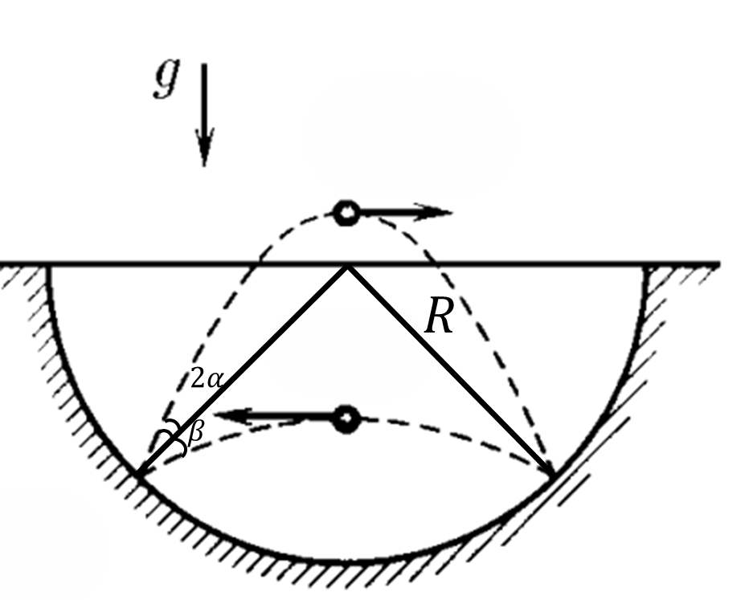

###  Statement 

$1.3.18^*.$ In a spherical hole, a ball jumps, elastically hitting its walls at two points located on the same horizontal line. The time interval between strokes when moving the ball from left to right is always equal to $T_1$, and when moving from right to left-$T_2 \ne T_1$. Determine the radius of the hole. 

### Solution

 

a) Find the radius of the hole, which is perpendicular to the surface of the hole at the points of impact and the impact is absolutely elastic, then the angles between the velocity vectors of the ball at the moments of impact and rebound are the same. Therefore, our problem is similar to the fact that from point $O$ (see fig.) two bodies with equal initial velocities oo are simultaneously thrown at angles to the horizon $\beta$ and $( \beta + 2 \alpha )$, respectively, and the flight range of both cases is the same.

$$ S = \frac{ v_{0}^{2} \sin 2 \beta}{g} = \frac{ v_{0}^{2} \sin 2 ( \beta + 2 \alpha ) }{g} $$ 

Where we get:

$$\sin 2 \beta = \sin 2( \beta + 2 \alpha )$, or $\beta + \alpha = 45^{ \circ}$$ 

Then the radius of the hole can be determined as:

$$ R= \frac{\frac{1}{2}S}{ \cos ( \beta + \alpha ) } = \frac{S}{ \sqrt{2} } $$ 

To determine the flight range $S$, we write the equations of motion of the body in projection onto the $Ox$ axis of the coordinate system:

$$ x_{1} = v_{0} \cos\beta t - \frac{1}{2} gt^{2}, x_{2} = v_{0} \cos ( \beta + 2 \alpha )t - \frac{1}{2} gt^{2} $$ 

At times $T_{1}$ and $T_{2}$, the coordinates $x_{1}$ and $x_{2}$ become zero. Therefore:

$$0 = v_{0} \cos\beta T_{1} - 1 /2 gT_{1}^{2}$$ 

$$ 0 = v_{0} \cos( \beta + 2 \alpha ) T_{2} - \frac{1}{2} gT_{2}^{2} $$ 

or taking into account that $\alpha = 45^{ \circ} - \beta$:

$$ v_{0} \cos\beta = \frac{1}{2} gT_{1}, v_{0} \sin\beta = \frac{1}{2} gT_{2} $$ 

Multiplying the last relations, we get:

$$ v_{0}^{2} \sin\beta\cos\beta = \frac{1}{4} g^{4}T_{1}T_{2} $$ 

Therefore, the flight range is:

$$ S = \frac{v_{0}^{2} \sin 2 \beta}{g} = \frac{gT_{1}T_{2} }{2} $$ 

and the radius of the hole:

$$ R = \frac{S}{ \sqrt{2}} = \frac{gT_{1}T_{2} }{2 \sqrt{2} } $$ 

#### Answer

$$R = gT_1T_2/(2\sqrt{2})$$ 
