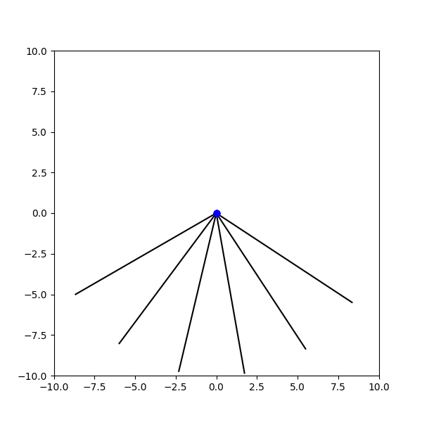

###  Statement

$1.3.2.$ a. From the top point of the circle, a ball begins to slide along a smooth chute at an angle $\varphi$ to the vertical. How long will it take for it to reach the circle, if its diameter is $D$?
b. From point $A$, small beads begin to slide along the spokes with different slopes at the same time without friction. What curve will the beads be on at time $t$?

### Solution

a) A ball will move along a smooth chute with acceleration equal to the projection of the free-fall acceleration in the direction of motion, i.e.

$$
a = g \cdot\cos{\varphi }
$$

The displacement of the ball is the chord of a circle of diameter $D$, the magnitude of which is related to the diameter, by the following relation

$$
r = D \cdot\cos{\varphi }
$$

Let's write further the equation of accelerated motion of the ball and from it find the time of motion

$$
{r=\frac{at^{2}}{2},\quad D\cos\varphi=\frac{g\cos\varphi}{2}t^{2},\quad t=\sqrt{\frac{2D}{g}} .}
$$

$$
\fbox{ $t=\sqrt{\frac{2D}{g}}$ } \tag{1}
$$

b) Note that the expression $(1)$ does not include the value of the angle, so all balls will be dropped simultaneously. They will lie on a circle of radius $r = g t^2/2$, as shown in the animation

#### Answer

a. $t = \sqrt{2D/g}$
b. On a circle of radius $\frac{gt^{2}}{2}$ with top point $A$.