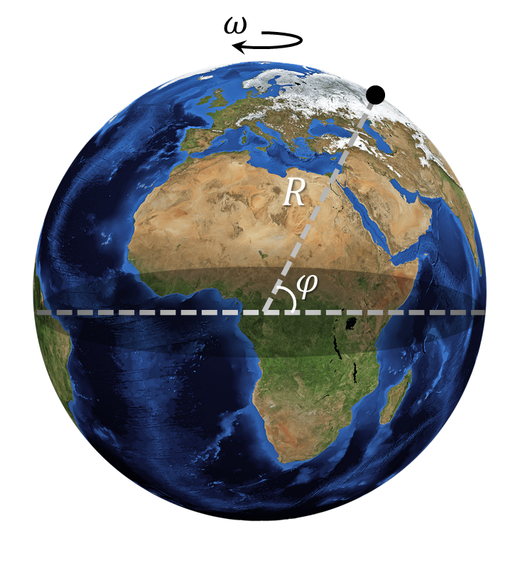

###  Statement 

$1.3.20.$ Determine the speed and acceleration that points on the Earth's surface at the equator and in St. Petersburg due to the Earth's participation in the diurnal rotation. Take the Earth's radius as $6400$ km. The latitude of St. Petersburg is $60^\circ$. 

### Solution

The Earth rotates around its axis with a period of $T = 24\;h$. Thus, the cyclic frequency of rotation is 

$$ \omega = \frac{2 \pi}{T} = 7.3 \cdot 10^{-5} \; c^{-1} $$ 

At the equator $\varphi = 0^{\circ}$, the distance to the rotation axis is $r =R$. And the speed will be equal to 

$$v = \omega R=1675\text{ km/h, }$$ 

The acceleration associated with daily rotation is found as 

$$a = \omega^2 R=0{,}034\text{ m/s}^2$$ 

At latitude $\varphi = 60^{\circ}$, the distance to the rotation axis is $r =R\cdot \cos\varphi$. And the speed will be equal to 

$$v = \omega R\cdot \cos\varphi=838\text{ km/h, }$$ 

The acceleration associated with daily rotation will be found as 

$$a = \omega^2 R\cdot \cos\varphi=0{,}017\text{ m/s}^2$$ 

#### Answer

$$\begin{array}{l}v_\text{e}=1675\text{ km/h, }a_\text{e}=0{,}034\text{ m/s}^2\\\v_{\text{l}}=838\text{ km/h, }a_{\text{l}}=0{,}017\text{ m/s}^2\end{array}$$ 
