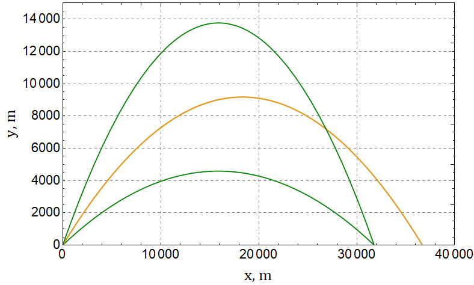

###  Statement 

$1.3.28.$ Projectiles fly out at an initial velocity of $600~\mathrm{\frac{m}{s}}$ at an angle of $30^\circ$, $45^\circ$, $60^\circ$ to the horizon. Determine the radius of curvature of the projectile trajectory at their highest and starting points. 

### Solution

At the initial moment of time, the normal component of $\vec{g}$, perpendicular to $\vec{v}$:

$$g_\perp = g \cos\alpha$$ 

Then the radius of curvature at the initial point is found as 

$$ \fbox{$R = \frac{v^2}{g \cos\alpha}$} $$ 

At the top point of the trajectory, the acceleration will coincide with the acceleration of gravity, and the speed will be equal to the horizontal

$$g_\perp = g$$ $$v = v_0 \cos\alpha$$ 

Similarly, the radius of curvature at this point is found as 

$$ \fbox{$R = \frac{v^2 \cos^2 \alpha}{g}$} $$ 

#### Answer

$27.5$ and $42.4\text{ km};$ $18.3$ and $52\text{ km};$ $0.2$ and $73.4\text{ km}$ 
