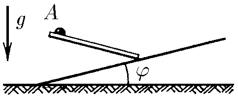

###  Statement 

$1.3.3.$ At what angle to the vertical should a smooth chute be directed from point $A$ so that the ball slides down it to the inclined plane in the shortest time? 

### Solution

Let's consider the possible directions of the gutter from point $A$. It is clear that by changing the angle of the gutter to the plane, the length of the gutter changes, but the acceleration with which the ball will move along the gutter also changes. From geometric considerations: $$ h = x \cdot \tan{\alpha} + x \cdot \tan{\varphi} $$ $$ l = \frac{x}{\cos{\alpha}}\tag{1} $$ The ball will roll with acceleration: $a = g \cdot \sin{\alpha}$. We find the time from the condition that the ball has traveled $l$: $$ l = \frac{a t^2}{2} $$ $$ \frac{x}{\cos{\alpha}} = \frac{g \cdot \sin{\alpha} \cdot t^2}{2} $$ Therefore, expressing from $(1)$ $x$, we obtain from the last equation: $$ t^2 = \frac{2h}{g \cdot \sin{\alpha} \cdot \cos{\alpha} (\tan{\alpha} + \tan{\varphi})} $$ The time will be minimal if $\xi =g \cdot \sin{\alpha} \cdot \cos{\alpha} (\tan{\alpha} + \tan{\varphi})$ is maximal. $$ \xi = \frac{\sin{\alpha}}{\cos{\varphi}} \sin{(\alpha + \varphi)} $$ $$ \xi = \frac{1}{2 \cos{\varphi}} (\cos{\varphi} - \cos{(2\alpha + \varphi)}) $$ This expression will be maximal when $\cos{(2\alpha + \varphi)}$ is minimal, and therefore equal to $-1$. Then $2\alpha + \varphi = \pi$, whence: $$ \alpha = \frac{\pi}{2} - \frac{\varphi}{2} $$ The angle of the gutter to the vertical is: $$ \beta = \frac{\pi}{2} - \alpha$$ $$ \fbox{$\beta =\frac{\varphi}{2}$} $$ 

#### Answer

The angle of the groove to the vertical at which the ball slides off in the least time is equal to $\frac{\varphi}{2}$. 
