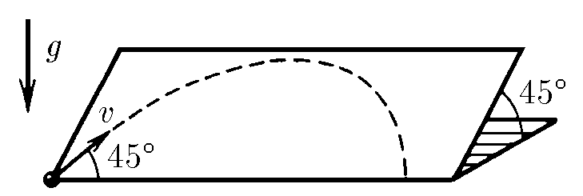
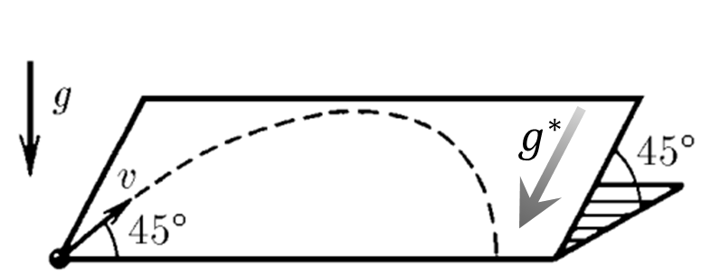

###  Statement

$1.3.7.$ A ball is launched along a smooth inclined plane at a speed of $v$. How much horizontal distance will it travel before it rolls off the plane? The plane is inclined to the horizon at an angle of $45^\circ$ . The initial velocity of the ball forms an angle of $45^\circ$ with the horizontal edge of the plane.

### Solution

On an inclined plane, the body is acted upon by the component of acceleration due to gravity:

$$
a = g^* = g \cdot \cos{45^{\circ}}
$$

From the formula for flight range obtained in [1.3.6](../1.3.6) it follows:

$$
L=\frac{v^2}{g^*}\operatorname{sin}90^{\circ}
$$

We substitute $g^*$:

$$
\fbox{$L=\frac{v^2 \sqrt{2}}{g}$}
$$

#### Answer

$$
L= \sqrt {2} v^{2} / g
$$