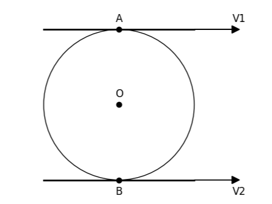

###  Statement

$1.4.13.$ A gear of radius $R$ is placed between two parallel gear racks. The slats move at a speed of $v_1$ and $v_2$ towards each other. What is the gear speed

### Solution

Let's move to the center of the disk. In this frame of reference, the speed of the upper and lower points of the disk is the same in magnitude and opposite in direction. Therefore,

$$
(v_{1} - v) = - (v_{2} - v)
$$

From where

$$
v = \frac{v_{1} + v_{2}}{2}
$$

We will find the rotation frequency as

$$
\nu = \frac{v}{R}
$$

Substitute $v$

$$
\fbox{$\nu = \frac{v_1 + v_2}{2R}$}
$$

#### Answer

$$
n = (v_1 + v_2)/(2R)
$$