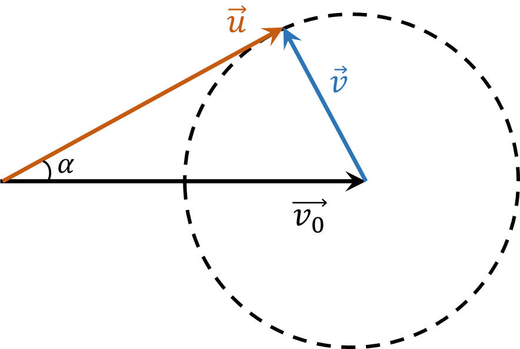

###  Statement

$1.4.14.$ A nucleus traveling at speed $v$ splits into two identical fragments. Determine the maximum possible angle $\alpha$ between the velocities of one of the fragments and the vector $v$, if the fragments have a velocity $u < v$ during the decay of a resting nucleus.

### Solution

The velocity and one of the accelerations of the nucleus are

$$
\vec{u} = \vec{v}_{0} + \vec{v}
$$

where $ \vec{v}_{0} $ is its velocity before the decay of the nucleus, $ \vec{v} $ is the velocity of the fragment relative to the resting nucleus (that is, in the coordinate system in which the nucleus was at rest before the decay).

Let's arrange the vector $ \vec{v}_{0} $ as shown in the figure. The end of the vector can lie on a circle of radius $| \vec{v} |$.

It is clear from the figure that the vector and forms the maximum angle $ \alpha$ with the vector $ \vec{v}_{0} $ if the angle between the vectors $ \vec{u} $ and $ \vec{v} $ is $ \pi / 2 $. In this case

$$
\fbox{$ \alpha = \arcsin \frac{v}{v_0} $}
$$

#### Answer

$$
\sin\alpha = u/v
$$