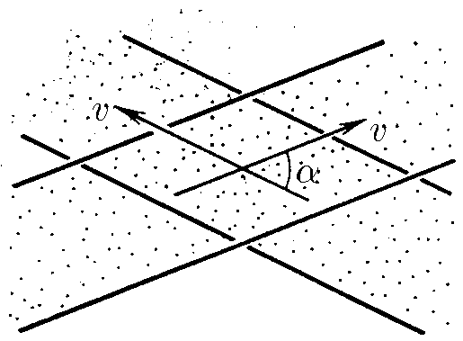

###  Statement

$1.4.16.$ Two beams of particles moving with the same modulo velocity $v$ intersect at an angle $\alpha$. Particle collisions occur in a limited area. Let's move on to the reference frame, where the particle velocities are equal in modulus and opposite in direction. It would seem that now the intersection area is the entire volume of beams, and therefore the number of collisions per unit time should be greater. Explain the resulting contradiction.

### Solution

In the new reference frame, the geometry of the beams, and therefore the area of ​​their intersection, are the same as before. The particle velocity is not necessarily directed along the beam.

When switching to another reference frame, the particles will also form a cross. Their velocities will simply be horizontal