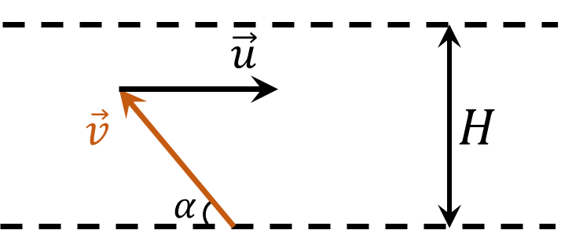
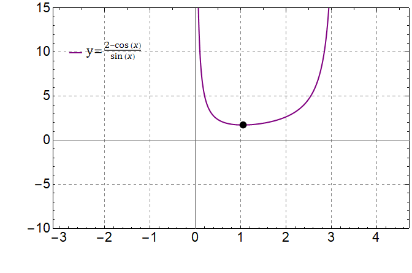

###  Statement 

$1.4.18^*.$ A boy who can swim at half the speed of a river wants to swim across the river so that he is not carried downstream as much as possible. At what angle to the shore should he swim? How far will it go if the river is $200\mathrm{~m}$ wide? 

### Solution

Consider the boy's movements with the speed $\vec{v}$, when he is carried away by the river with the current $\vec{u}$

Let's write in projections on the horizontal and vertical axes, taking into account that $u = 2v$

$$v_x = 2v - v \cos\alpha$$

$$v_y = v \sin\alpha$$

Find the time it takes the boy to swim across the river

$$ t = \frac{H}{v_y} = \frac{H}{v \sin\alpha} $$ 

During time $t$ it will be carried along the coast by an amount

$$ L = v_xt = H\frac{2 - \cos\alpha}{\sin\alpha}\tag{1} $$ 

To find the minimum of $L$, it is necessary to find the extremum of the function $f(\alpha ) = \frac{2 - \cos\alpha}{\sin\alpha}$ on the interval $\alpha\in (0,\pi )$

  Graph of the function $f(\alpha ) = \frac{2 - \cos\alpha}{\sin\alpha}$ 

Let's find $\alpha$, at which the derivative is equal to $0$ 

$$ \frac{df}{d \alpha} = \frac{\sin^2 \alpha - \cos\alpha (2-\cos\alpha )}{\sin^2 \alpha}=0 $$ 

$$1-2 \cos\alpha =0$$

$$\fbox{$\alpha = \pi /3$}$$

Substitute into $(1)$ and find the distance it will be carried away 

$$\fbox{$L = H\sqrt{3}$}$$

#### Answer

More drops fall on a rolling ball in $\dfrac{N_2}{N_1} = \sqrt{1 + \dfrac{v^2}{u^2}}$ times.
