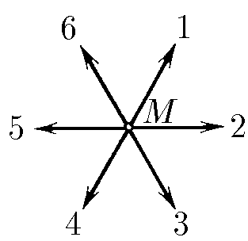

###  Statement

$1.4.2.$ In the figure, the velocities of six hares released by the old Mazai are shown in a coordinate system that is stationary relative to the Mazai. Try drawing the velocities of Mazai and the other hares in a coordinate system that is stationary relative to hare $1$.

### Solution

To go to the inertial reference frame associated with the first hare, you need to subtract the velocity vector of the 1st hare from all other velocity vectors

Thus, the desired velocity pattern looks like this

