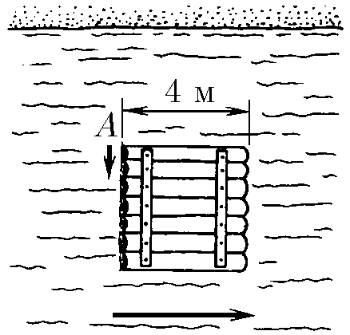
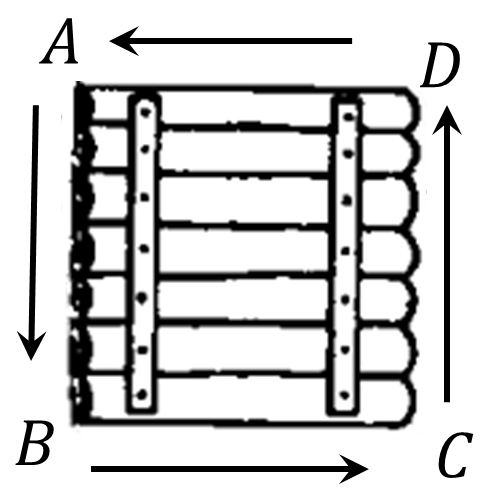
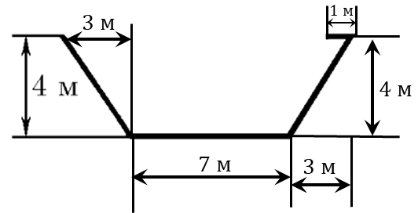

###  Statement 

$1.4.4.$ From corner $A$ of a square raft, a dog jumped into the water and swam around the raft. Draw the dog's trajectory relative to the shore if it is swimming along the sides of the raft, and its speed relative to the water is $\frac{4}{3}$ of the speed of the river current. 

### Solution

Let's consider the dog's movement relative to the shore 

 

On segment $AB$ the dog swims $4\text{ m}$ vertically and is washed away $3\text{ m}$ horizontally. 

Next, on $BC$ the dog swims $4\text{ m}$ horizontally along the river current and is washed away $3\, m$ in the same direction. 

On $CD$ the dog swims $4\text{ m}$ vertically, but in a different direction, and is again washed away $3\text{ m}$ along the river current. 

On the last segment, the dog swims against the river current for $4\text{ m}$, and the river washes away for $3\text{ m}$, making a total movement of $1\text{ m}$ against the river current. 

 

#### Answer

See figure
