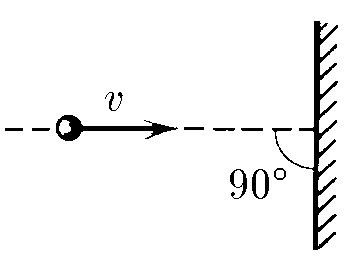

###  Statement 

$1.4.8.$ In case of an elastic impact of a body against a fixed wall, its velocity $v$ changes only in the direction. Determine the change after the impact of the velocity of this body, if the wall is moving: 
a) at a speed $u$ towards the body; 
b) at a speed $w < v$ in the direction of movement of the body. 

### Solution

The whole point of the problem is to move to an inertial system associated with the wall, correctly describing the relative velocity.

$a)$ In the case when the wall "catches up" with the ball, it is necessary to move to a frame of reference in which the wall is at rest.

In this frame of reference, the relative velocity of the ball before the impact is

$$v_{0} + u$$

After the elastic impact, the velocity projection changes sign: it becomes equal to 

$$(- v_{0} - u)$$

If we then return to the original (laboratory) frame of reference, where the wall moves with a velocity of $u$, then the velocity of the ball here is 

$${v}' = - v_{0} - 2u$$

The change in velocity in this case is 

$$\fbox{$\Delta v = {v}' - v_{0}$ $= - 2(v_{0} + u)$}$$ 

$b)$ Similarly, we need to go to the frame of reference in which the wall is at rest. 

In this frame of reference, the relative velocity of the ball before the impact is $v_{0} - w$. After the elastic impact, the projection of the velocity changes sign: it becomes equal to 

$$(- v_{0} + w)$$ 

If we then return to the original (laboratory) frame of reference, where the wall moves with the velocity $w$, then the velocity of the ball is 

$${v}' = - v_{0} + 2w$$ 

The change in velocity in this case is 

$$\fbox{$\Delta v = {v}' - v_{0}$ $= - 2(v_{0} - w)$}$$ 

#### Answer

a) $\Delta v = -2(v + u).$
b) $ \Delta v = -2(v - w).$ Projection on the direction of the initial speeds are considered positive.
