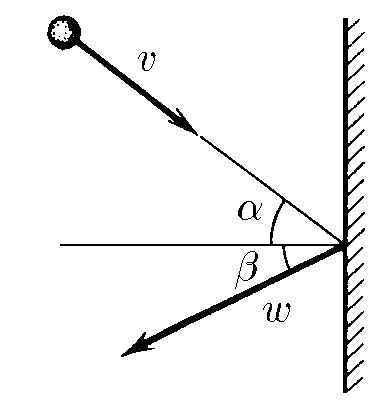
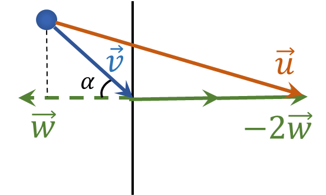
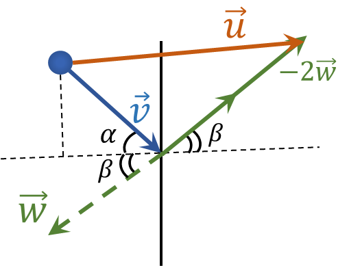

###  Statement

$1.4.9.$ The body hits the wall with velocity $v$ and angle $\alpha$ to the line perpendicular to the wall. Determine the velocity of the body after an elastic impact if the wall is:
a) stationary;
b) moving perpendicular to itself at a speed $w$ towards the body;
c) moving at an angle $\beta$ to the line perpendicular to it at a speed $w$ towards the body.

### Solution

$a)$ Since the collision is elastic, then according to the Law of Conservation of Momentum:

$$
v \sin\alpha = u \sin\alpha
$$

$$
\fbox{$v = u $}
$$

$b)$ Further, this problem is a little reminiscent of [1.4.8](../1.4.8).

In the frame of reference associated with the wall, the relative velocity of the ball $\vec{v_{rel}} = \vec{v} - \vec{w}$. During elastic reflection, passing into the earth's frame of reference, the velocity is equal to $\vec{u} = \vec{v} - 2\vec{w}$.

Working with vector quantities is clearly demonstrated below

Let's find the projections of the vector $\vec{u}$ on the horizontal and vertical axes:

$$
u_y = v \sin\alpha
$$

$$
u_x = v \cos\alpha + 2w
$$

Using the Pythagorean theorem, we find the modulus of the vector $\vec{u}$

$$
u = \sqrt{u_x^2+u_y^2}
$$

$$
u = \sqrt{(v \sin\alpha )^2 + (v \cos\alpha + 2w)^2}
$$

$$
\fbox{$u=\sqrt{v^{2}+4vw\cos\alpha +4w^{2}}$}
$$

$c)$ Similar to the previous subparagraph

$$
\vec{u} = \vec{v} - 2\vec{w}
$$

We will show these vectors in the figure

We will find the projections of the vector $\vec{u}$ on the horizontal and vertical axis:

$$
u_y = v \sin\alpha - 2w \sin\beta
$$

$$
u_x = v \cos\alpha + 2w \cos\beta
$$

Using the Pythagorean equation, we find the modulus of the vector $\vec{u}$

$$
u = \sqrt{u_x^2+u_y^2}
$$

$$
u = \sqrt{(v \sin\alpha - 2w \sin\beta )^2 + (v \cos\alpha + 2w \cos\beta )^2}
$$

$$
\fbox{$u=\sqrt{v^{2}+4vw\cos\alpha\cos\beta +4w^{2}\cos^{2}\beta}$}
$$

#### Answer

a) $u=v$
b) $u=\sqrt{v^{2}+4vw\cos\alpha +4w^{2}}$
c) $u=\sqrt{v^{2}+4vw\cos\alpha\cos\beta +4w^{2}\cos^{2}\beta}$