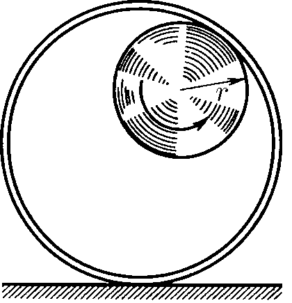
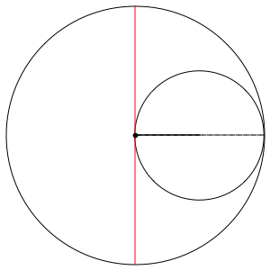

###  Statement

$1.5.10.$ On the inner surface of a fixed cylinder of radius $2r$, a wheel of radius $r$ rolls without slipping. Find the path of the wheel rim point.

### Solution

This trajectory is the so-called [Hypocycloid](https://en.wikipedia.org/wiki/Hypocycloid) Given by the parametric equation:

$$
\begin{gathered}\begin{cases}x=r(k-1)\left(\cos t+\frac{\cos((k-1)t)}{k-1}\right)\\\y=r(k-1)\left(\sin t-\frac{\sin((k-1)t)}{k-1}\right)&\end{cases}\end{gathered}
$$

For $r= R/2$, this trajectory lies on the diameter

###  Proof:

Let the circles initially touch at point $A$, lying on the $Ox$ axis, where point $O$ is the center of the large circle. The coordinates of point $A$ are $ (kr, 0) $, where $ k = \frac{R}{r} $. Let us consider how the coordinates of point $A$, tied to the rolling circle ($A$ goes to $ A' $), change. Let the small circle roll so that its center moves from point $ C' $ to point $ C'' $ and rotates relative to point $ O $ by angle $ t $.

First, it can be shown that the rotation of the small circle relative to its center (i.e. the angle between $ CA $ and $ C' A' $) is equal to $ t - kt = -(k-1)t $. Second, the coordinates of point $ C' $ will be as follows: $ (cos(t)(k-1)r, \sin(t)(k-1)r) $. Then, knowing where the center of the rolling circle will go and at what angle it has turned relative to this center, we can write down the coordinates of point $ A' $:

$ \begin{cases} x = \cos(t)(k-1)r + \cos((k-1)t)r \\\ y = \sin(t)(k-1)r - \sin((k-1)t)r \end{cases} $

#### Answer

The trajectory of the wheel rim point passes along the cylinder diameter.