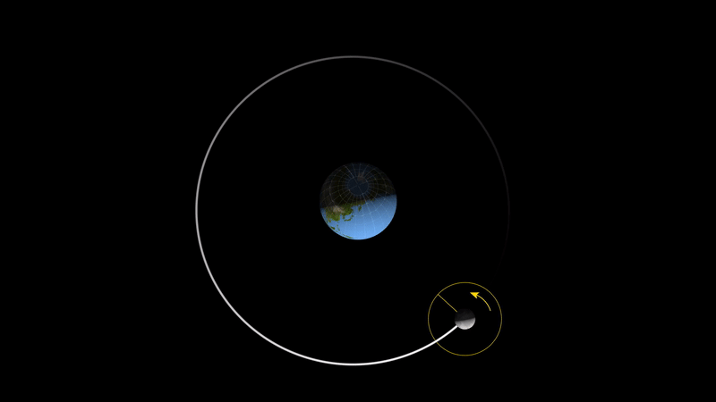

###  Statement

$1.5.11.$ a. The moon is always facing the Earth on one side. How many revolutions will it make around its axis during a complete revolution around the Earth?

b. How much shorter are sidereal days than solar days on average? The Earth goes around the Sun in $365.25$ sunny days.

### Solution

a) The Moon makes one complete revolution around the Earth in one lunar month. At the same time, the Moon makes one complete revolution around its axis in the same period. This is explained by the fact that the Moon always faces the Earth with the same side due to a phenomenon called synchronous rotation.

b) To understand the difference, it is necessary to take into account that in one year ($365.25$ solar days) the Earth makes one complete revolution around the Sun. During this time, the Earth makes one more revolution around its axis than the number of solar days in a year, since each day the Earth must turn a little more for the Sun to appear in the same place in the sky again.

The Earth makes one complete revolution around the Sun in $365.25$ solar days:

$$
T_{\text{solar}} = 365.25
$$

The number of stellar days for this period will be one more, that is:

$$
T_{\text{starry}} = T_{\text{solar}} + 1 = 366.25
$$

Let's calculate the difference between solar and stellar days:

$$
t_{\text{starry}} = \frac{24 \cdot 365.25}{366.25}
$$

Difference between solar and stellar days:

$$
\Delta t = 24 \left( 1 - \frac{365.25}{366.25} \right) \approx 4 \text{ min}
$$

NO: More [wikipedia.org](https://en.wikipedia.org/wiki/Sidereal_time)

#### Answer

a. One revolution.
b. For 4 minutes.