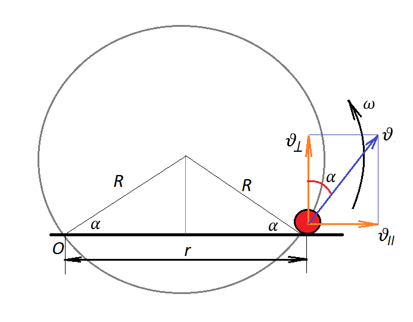

###  Statement

$1.5.12.$ A bead can move along a ring of radius $R$, pushed by a spoke that rotates uniformly with angular velocity $\omega$ in the plane of the ring. The axis of rotation of the spoke is located on the ring. Determine the acceleration of the bead.

### Solution

The bead will move along the spoke with the velocity $\upsilon_{\parallel}$, and since the spoke rotates, the bead will have a velocity component perpendicular to the spoke: $\upsilon_{\perp}$

Then the absolute velocity $\vec{v}$ in Non-inertial reference frame will be equal to the vector sum of $\vec{v}_{rel}$ and $\vec{v}_{cl}$

$$
\upsilon_{\perp}=\omega r=\omega\cdot 2R\cos\alpha
$$

On the other hand,

Then the absolute velocity $\vec{v}$ in Non-inertial reference frame will be equal to the vector sum of $\vec{v}_{rel}$ and $\vec{v}_{cl}$

$$
\upsilon_{\perp}=\upsilon\cos\alpha
$$

Since the speed of a bead moving in a circle is directed perpendicular to the radius.

Then

$$
\omega\cdot 2R\cos\alpha =\upsilon\cos\alpha
$$

$$
\upsilon =2R\omega =\text{const}
$$

Since the speed does not change in magnitude, the bead has only normal acceleration

$$
a_n=\frac{\upsilon^2}{R}=\frac{4\omega^2R^2}{R}=4\omega^2R
$$

#### Answer

$$
a_n=4\omega^2R
$$