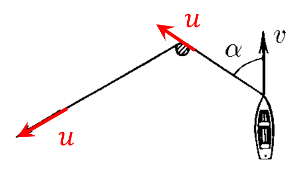

###  Statement

$1.5.13.$ The rope tied to the boat is pulled by the free end so that it does not sag. The boat moves at a constant speed $v$, forming at some point in time an angle $\alpha$ with the length of rope located between the pole and the boat. How fast should the free end of the rope be pulled at this point in time?

### Solution

If the rope doesn't slacken

$$
\fbox{$u=\upsilon\cos\alpha$}
$$

And since all points of the rope have the same speed, the rope must be pulled with exactly the speed $u$.

#### Answer: $u = v \cos\alpha$