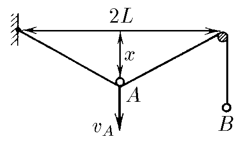
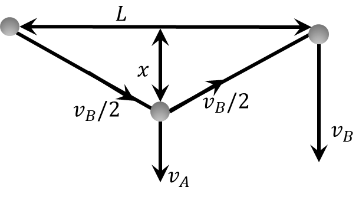

###  Statement

$1.5.15^*.$ Plot an approximate graph of the speed of point $B$ as a function of time, if the speed $v_A$ of point $A$ is constant. Find the formula for this relationship if $x(0) = 0$.

### Solution

  Velocity distribution on threads

NO: Before viewing the solution to this problem, I advise you to familiarize yourself with the solution [1.5.14](../1.5.14)

At time $t$, the height to which the point dropped

$$
x = v_A t\quad(1)
$$

Let's consider the change in the length of the thread over a small period of time $dt$

$$
dl = \sqrt{L^2 + (x+dx)^2}-\sqrt{L^2 + x^2}
$$

$$
dl = \sqrt{L^2 + x^2}\cdot \left(\sqrt{1 + \frac{2xdx}{L^2 + x^2}}-1\right)
$$

We will use the formula for small quantities $(1+x)^\alpha\approx 1+\alpha x$, where $x\rightarrow 0$:

$$
dl = \frac{xdx}{\sqrt{L^2 + x^2}}
$$

Given that $v_B = \frac{dl}{dt}$ and $v_A = \frac{dx}{dt}$

$$
v_B = \frac{x}{\sqrt{L^2 + x^2}} \frac{dx}{dt}
$$

$$
v_B = v_A\frac{x}{\sqrt{L^2 + x^2}}
$$

Substitute $(1):$

$$
\fbox{$v_B = \frac{v_A^2t}{\sqrt{L^2 + v_A^2t^2}}$}
$$

NO: A more detailed and beautiful problem with a similar idea can be found in ["Very Long Physics Problems"](https://belphol.github.io/books/LongProblemsPart1.pdf) by A.I. Slobodyanyuk (Problem 2)

#### Answer:

$$
v_B = \frac{v_A^2t}{\sqrt{L^2 + v_A^2t^2}}
$$