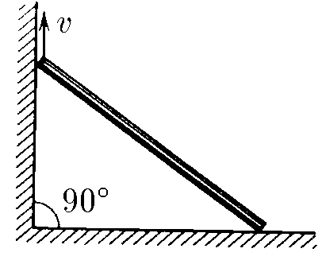
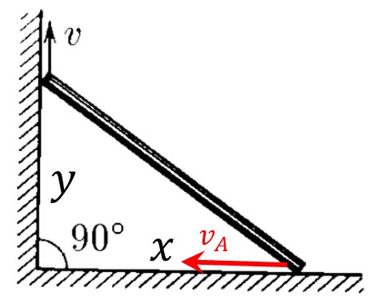
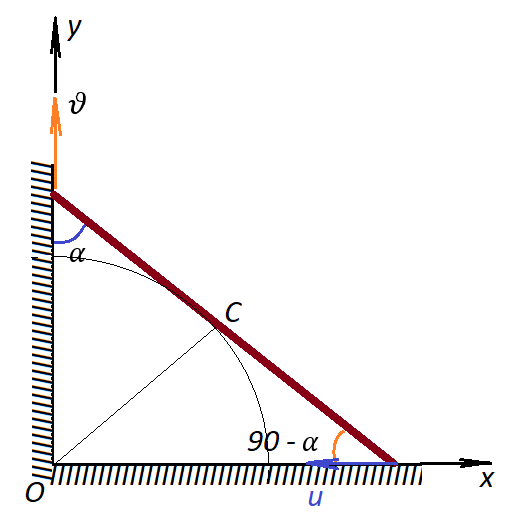

###  Statement

$1.5.16.$ The rod rests its ends on the sides of a right angle. The upper end of the rod is lifted at a speed of $v$. Find how the speed of its lower end depends on time. Take the moment when the upper end is at the top of the corner as the beginning of the time reference. Rod length $L$.

### Solution

NO: Before viewing the solution to this problem, I recommend that you familiarize yourself with the solution to [1.5.14](../1.5.14) and [1.5.15](../1.5.15)

At time $t$, the height to which the upper end has risen

$$
y = v t\quad(1)
$$

Consider the change in coordinate $x = \sqrt{L^2-y^2}$ over a small period of time $dt$

$$
dx = \frac{ydy}{\sqrt{L^2 - y^2}}
$$

Considering that $v = \frac{dy}{dt}$ and $v_A = \frac{dx}{dt}$

$$
v_A = \frac{vy}{\sqrt{L^2 - y^2}}
$$

Substitute $(1)$

$$
\fbox{$v_A = \frac{v^2t}{\sqrt{L^2 - v^2t^2}}$}
$$

###  Alternative solution:

The coordinate of the upper end can be found as

$$
y=\upsilon t
$$

The projections of the velocities of both ends onto the direction of the rod are:

$$
\upsilon\cos\alpha =u\cos(90^{\circ}-\alpha )
$$

$$
\upsilon\cos\alpha =u\sin\alpha
$$

$$
u=\upsilon\operatorname{ctg}\alpha =\upsilon\frac{y}{x}
$$

By the Pythagorean theorem

$$
x^2+y^2=L^2
$$

$$
x=\sqrt{L^2-y^2}=\sqrt{L^2-\upsilon^2t^2}
$$

Since the velocity $u$ is directed against the $x$ axis, then

$$
x’=-u
$$

$$
u=-\frac{\frac{1}{2}\cdot 2t\cdot (-\upsilon^2)}{\sqrt{L^2-\upsilon^2t^2}}
$$

$$
u=\frac{t\cdot \upsilon^2}{\sqrt{L^2-\upsilon^2t^2}}
$$

If you connect the center of the rod with the vertex of the right angle, then this segment will be the median of the right triangle and will be equal to half the length of the hypotenuse. It turns out that the center of the rod moves along a circle with the center at point $O$.

#### Answer

$$
v_A = \frac{v^2t}{\sqrt{L^2 - v^2t^2}}
$$