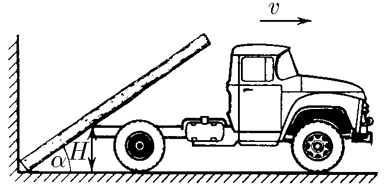

###  Statement

$1.5.17.$ The log, resting its lower end in the corner between the wall and the ground, touches the bottom of the truck at a height $H$ from the ground. Find the angular velocity of the log as a function of the angle $\alpha$ between it and the horizontal if the truck is moving away from the wall at speed $v$.

### Solution

__NO__: Before viewing the solution to this problem, I recommend that you familiarize yourself with the solution [1.5.16](../1.5.16)

At time $t$ the car will travel the distance $vt$ and the bottom will have horizontal coordinate $x$

$$
x = H \tan\alpha\quad(1)
$$

Let's consider the change in angle $\alpha = \arctan \frac{H}{x}$ over a small period of time $dt$

$$
d\alpha = d\left(\arctan \frac{H}{x}\right)
$$

$$
d\alpha = \frac{1}{1+\frac{H^2}{x^2}} \frac{H}{x^2}
$$

$$
d\alpha = dx\frac{H}{x^2+H^2}
$$

Considering that $\omega = \frac{d \alpha}{dt}$ and $v = \frac{dx}{dt}$

$$
\omega = \frac{vH}{x^2+H^2}
$$

Substitute $(1)$

$$
\omega = \frac{v}{H(1 + \tan^2 \alpha )}
$$

$$
\fbox{$\omega = \frac{v \sin^2 \alpha}{H}$}
$$

###  Alternative solution:

In time $\Delta t$ the truck will travel a distance

$$
\Delta l=\upsilon\Delta t
$$

The log will drop slightly, turning at a small angle $\Delta \alpha$. If the length of the arc of rotation is $\Delta x$, then by definition of the radian measure of angle

$$
\Delta \alpha =\frac{\Delta x }{R}
$$

Angular velocity is defined as

$$
\omega =\frac{\Delta \alpha}{\Delta t }=\frac{\Delta x }{R\Delta t }
$$

Но $\Delta x =\upsilon\Delta t\sin\alpha$.

$$
\omega =\frac{\upsilon\Delta t\sin\alpha}{R\Delta t }=\frac{\upsilon\sin\alpha}{R}
$$

We can also write that

$$
H=R\sin\alpha
$$

With this in mind

$$
\omega =\frac{\upsilon\sin^2 \alpha}{H}
$$

#### Answer

$$
\omega = \frac{v \sin^2 \alpha}{H}
$$