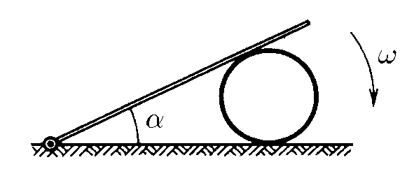

###  Statement

$1.5.18.$ The rod, with one end pivotally fixed on a horizontal plane, lies on the cylinder. Angular velocity of the rod $\omega$. There is no slippage between the cylinder and the plane. Find the dependence of the angular velocity of the cylinder on the angle $\alpha$ between the rod and the plane.

### Solution

NO: Before viewing the solution to this problem, I advise you to familiarize yourself with the solution [1.5.17](../1.5.17)

By the time $t$ the rod will form an angle $\alpha$

Consider the change in coordinate $x = AC$ over a short period of time $dt$

$$
dx = d\left(\frac{R}{\tan (\frac{\alpha}{2})}\right)
$$

I share both honors with $dt$

$$
\frac{dx}{dt} = \frac{d\left(\frac{R}{\tan\alpha /2}\right)}{dt}
$$

Considering that $\omega = \frac{d \alpha}{dt}$ and $v = \frac{dx}{dt}$

$$
v = \frac{\omega R}{2 \sin^2 \left(\frac{\alpha}{2}\right)}
$$

Let's write down the condition of no slippage

$$
\omega ' R = v
$$

From here

$$
\fbox{$\omega ' = \frac{\omega}{2 \sin^2 \left(\frac{\alpha}{2}\right)}$}
$$

#### Answer: $\omega_0 = \omega /2 \sin^2 (\alpha /2)$